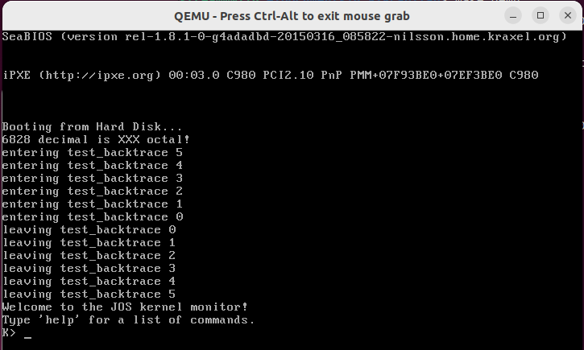
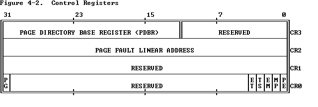

# MIT CS6.828-Lab 1: Booting a PC

## Part 1: PC Bootstrap

### 0. 前置知识

#### x86、i386、x86-64

**x86 **，又称 **IA-32**（Intel Architecture, 32-bit），泛指一系列基于Intel 8086且向后兼容的中央处理器指令集架构。这个名称源于这个系列早期的处理器名称，它们都是`80x86`格式，如`8086`、`80186`、`80286`等。

**需要特别指出的是**，x86系列的第一款芯片`8086`支持16位运算（即运算器一次最多能处理16位长的数据、寄存器最大长度为16位、寄存器和运算器之间的数据通路为16位），但有20位地址总线，即可寻址内存大小为 1MB。

**i386** 是`80386`处理器的别名，但一般来说”适用于 i386“等同于"适用于i386采用的架构 x86"，因此在相关语境下将 **i386** 视为指代 **x86** 架构也是可以的

**x86-64** 是基于 x86 的 64 位扩展架构。一般说 **x86** 是 32 位架构（虽然最初两代CPU是16位的），将该架构扩展至 64 位是AMD先于Intel完成的，并命名为 **AMD 64**，Intel随后才推出与 **AMD 64** 架构兼容的处理器，并命名为 **Intel 64**，即 **x86-64**。

（注：x86=IA-32，但 x86-64≠IA-64，IA-64 是全新的架构，与 x86 完全没有相似性）

#### 汇编指令格式：AT&T 

实验中 GDB 调试显示的汇编代码都是 AT&T 格式。对于本实验而言，有汇编基础再好不过，但如果没有，也没必要完整学一遍再来，对下列常用语法格式有个大致印象就够用了，出现陌生语法再查。

```assembly
pushb %eax 
# 将寄存器eax的值压栈。寄存器名前要加%，后缀b表示操作数字长为低8位
pushb $1 # 将十六进制数1压栈。直接给出数值（称为立即数）时要在前面加$
```

```assembly
addl $1, %eax 
#将寄存器eax的值+1后结果存入eax，后缀l表示操作数字长为全部32位
movw %ebx, %eax
#将寄存器ebx的值赋给寄存器eax，后缀w表示操作数字长为低16位
```

#### 实模式与保护模式

**实模式**

x86 系列的第一代芯片`8086` 是 16 位处理器，有 20 根地址线，只支持`1MB`内存空间寻址。 x86 架构是向后兼容的，为了保证当初基于`8086`设计的程序在如今普遍内存大小为`4GB`的 x86 计算机中还能正常运行，必须将这初始的`1MB`保留下来，且当年`8086`在这`1MB`内存空间里遵循的一些规则，后续的 x86 系列芯片也必须遵循。

这`1MB`空间以及在这空间内采用的寻址方式、地址长度等等当年`8086`遵循的规定，就是**实模式**。

显然当年`8086`加电执行的第一条指令只能存储在这`1MB`中，因此后来的 x86 芯片加电执行的第一条指令也必然存储在这`1MB`空间中，这已成为设计规范以保证向后兼容性。也就是说，x86 系列芯片加电后都首先进入实模式，完成与当年`8086`开机引导类似的操作后，再打开某个开关，启用这`1MB`以外的地址空间，从实模式切换到**保护模式**。

- 寻址空间

  实模式下，寻址空间为`1MB`，具体的地址范围为`0x00000`到`0xFFFFF`；

- 地址计算方式

  由于`8086`的寄存器是 16 位长的，要表示 20 位长的地址，要使用`cs`和`ip`两个寄存器，地址计算方式如下：

  物理地址  = 段基址(cs) × 16 + 段内偏移量(ip)

  即使后来的 x86 芯片的寄存器有 32 位长，足够存储完整地址，在实模式下也必须按照上述方式进行地址存储和计算。

- 寄存器

  - 通用寄存器

    x86 系列芯片的通用寄存器都有 8 个，名称及特定用途都沿用自初代芯片`8086`。后来芯片位数扩展到 32 位，通用寄存器也相应扩展到 32 位，在原来名称的基础上开头加了`E`，与`8086`的 16 位寄存器相区别。

    - EAX：一般用作累加器（Add）
    - EBX：一般用作基址寄存器（Base）
    - ECX：一般用来计数（Count）
    - EDX：一般用来存放数据（Data）
    - ESP：一般用作堆栈指针（Stack Pointer）
    - EBP：一般用作基址指针（Base Pointer）
    - ESI：一般用作源变址（Source Index）
    - EDI：一般用作目标变址（Destinatin Index）

  - 状态寄存器
    - EFLAGS：状态标志寄存器。分为CF、ZF、SF、OF等状态位。
    - DF：Direction Flag。设置DF标志使得串指令自动递减（从高地址向低地址方向处理字符串），清除该标志则使得串指令自动递增。STD以及CLD指令分别用于设置以及清除DF标志。
  - 段寄存器
    - CS (Code Segment)：代码段寄存器；
    - DS (Data Segment)：数据段寄存器；
    - SS (Stack Segment)：堆栈段寄存器；在16位下与SP寄存器组合使用，SS:SP作为栈顶指针；在32位下ESP寄存器足够作为栈顶指针，SS就无关紧要了。
    - ES (Extra Segment)：附加段寄存器；

**保护模式**

`8086`、`80186`都是 16 位处理器、20位物理地址，没有虚拟内存的概念，每一个地址都能在存储芯片中一一对应地找到物理存储单元，必须也只能运行在实模式下。

从`80286`（16位处理器）开始有了虚拟内存，为了进行虚拟内存管理，从早先的**段基址**寄存器演化出专门的**段表**，寻址方式也不再遵循实模式下的计算方式，需要从实模式中区分出来，因此有了 **16 位保护模式**。

从`80386`开始，处理器都为 32 位，对应引入了 **32 位保护模式**。Windows 2000 、Windows XP 都是在 32 位保护模式下运行的。

保护模式下，寻址范围不再受制于实模式下的 `1MB`，地址计算方式也有所不同。

### 1. 试运行 JOS

1. 下载 Lab 1 源码：`git clone https://pdos.csail.mit.edu/6.828/2018/jos.git lab`

2. 构建 JOS 镜像：

   ```bash
   $ cd lab && make
   # 应显示以下信息
   + as kern/entry.S
   + cc kern/entrypgdir.c
   + cc kern/init.c
   + cc kern/console.c
   + cc kern/monitor.c
   + cc kern/printf.c
   + cc kern/kdebug.c
   + cc lib/printfmt.c
   + cc lib/readline.c
   + cc lib/string.c
   + ld obj/kern/kernel
   ld: warning: section `.bss' type changed to PROGBITS
   + as boot/boot.S
   + cc -Os boot/main.c
   + ld boot/boot
   boot block is 396 bytes (max 510)
   + mk obj/kern/kernel.img
   ```

3. 运行JOS：`make qemu`（注：如果用的Linux是云服务器之类的没有图形界面只有命令行，使用`make qemu-nox`）

   

   按`Ctrl+a x`退出 JOS

4. 到这一步说明 Lab 1 的环境配置已经完成了，我们接下来的任务就是以这个只有简单功能的 OS 作为研究对象，分析 CPU 从加电执行第一条指令开始到加载 JOS 的过程。

### 2. 使用 GDB 研究 PC 启动的第一步

打开一个shell窗口，执行

```bash
cd lab && make qemu-gdb #如果没有图形界面，使用make qemu-nox-gdb
```

再开一个shell窗口，执行

```bash
cd lab && make gdb
```

应显示以下信息

```bash
$ cd lab && make gdb
gdb -n -x .gdbinit # GDB 的启动配置文件，由 lab 提供
... # 一堆 GDB 的版本及介绍信息
The target architecture is set to "i8086".
# JOS 系统程序的第一条指令
[f000:fff0]    0xffff0:	ljmp   $0xf000,$0xe05b
0x0000fff0 in ?? ()
+ symbol-file obj/kern/kernel
```

> 注意！如果你的第一条指令是0xffff0:	ljmp   \$0x3630,$0xf000e05b，说明 GDB 以32位而不是16位来解释，这个问题的出现可能是因为你使用的是apt-get安装的QEMU而非6.828课程提供的定制版QEMU，强烈建议使用后者。

在分析第一条指令在做什么之前，需要先搞清楚我们正在什么样的硬件环境里。

我们用QEMU模拟了一个与 i386 相同的硬件环境，并在此硬件环境上加载 JOS。而 i386 采用 x86 架构。因为 x86 架构向后兼容，所以有一些”设定“继承自 x86 系列最早的处理器 `8086`。

（下面的地址都用8位16进制数表示，可表示的内存大小为4GB，这是目前<呃，好像也过时了>我们所用计算机的普遍内存大小，也是 i386 的物理寻址空间大小）

前面提过，`8086`的寻址空间大小为`1MB `。因此在这里需要理解的第一个古老”设定“是，从`0x00000000`开始，到`0x00FFFFFF`结束的这`1MB`大小空间是特殊的，保留用作特定用途。（这样一来，当年基于 8086 这 1MB 内存而编写的程序，在如今的最新 x86 架构上也能正常运行，因为这 1MB 空间依然是和当年一样的用途）

这`1MB`被分为各个区域，分别用作特定用途，如下图所示：

```
+------------------+  <- 0x00100000 (1MB) (注：1MB空间最后一个地址0x000FFFFF)
|     BIOS ROM     |
+------------------+  <- 0x000F0000 (960KB)
|  16-bit devices, |
|  expansion ROMs  |
+------------------+  <- 0x000C0000 (768KB)
|   VGA Display    |
+------------------+  <- 0x000A0000 (640KB)
|                  |
|    Low Memory    |
|                  |
+------------------+  <- 0x00000000
```

其中，需要我们特别关注的是`0x000F0000`到`0x000FFFFF`这 64 KB 空间。对于早期 PC ，BIOS 存储在 ROM 中，这 64 KB 就是在 ROM 中的寻址空间。

BIOS 是 CPU 加电后执行的第一个程序，前面显示的`[f000:fff0] 0xffff0: ljmp $0xf000,$0xe05b`就是 BIOS 的第一条指令。

我们目前所处的位置及要分析的内容，就是QEMU模拟出来的 80386 芯片加电后启动的第一步：执行BIOS。

现在来分析第一条指令：

`[f000:fff0] 0xffff0: ljmp $0xf000,$0xe05b`

- `[f000:fff0]`：`f000`是寄存器`cs`的值，`fff0`是寄存器`ip`的值。
- `0xffff0`：指令的起始地址。我们知道 BIOS 所在区域的地址最大为`0xfffff`（这里省略了高位的0），说明第一条指令存放在这块内存区域的最顶端`0xffff0`到`0xfffff`，指令长度为16字节（注意，这里说的是机器码的长度，而非我们看见的汇编指令的长度）。
- `ljmp $0xf000,$0xe05b`：汇编指令，`ljmp`为转移指令，`l`表示目标地址为16位地址，后面两个立即数中，`$0xf000`是给寄存器`cs`的值，`$0xe05b`是给寄存器`ip`的值。

`cs`、`ip`这两个寄存器的值与实际地址之间是什么关系？

前面提到，第一条指令的地址之所以是`0xffff0`，是因为第一代 x86 CPU `8086` 就是如此。实际上，在这 `1MB` 内存区域内进行的操作，都得遵循当年`8086`的规则（此时所处的就是所谓的**实模式**） 。而`8086` 是 16 位处理器，却有 20 根地址线，地址长度为 20 位。为了能用 16 位的寄存器表示 20 位的地址，`8086`使用以下转换公式进行转换：

物理地址  = 段基址(cs) × 16 + 段内偏移量(ip)

事实上，乘法对于CPU来说是很复杂的，所以 ×16 的操作实际是通过将值左移4位来实现的，即：

物理地址 = 段基址(cs) << 4 + 段内偏移量(ip)

`f000`左移4位就变成了`f0000`（别忘了十六进制和二进制之间是如何转换的），再加上`fff0`，就变成了 GDB 显示的地址 `ffff0`。

同理，我们可以计算出这条`ljmp`指令的跳转目标地址：`f0000`+`e05b`=`fe05b`。

综上，我们知道了QEMU模拟的这个`i386` 机器在按下电源键之后干的第一件事：CPU读取并执行起始地址为`0xffff0`处的（这个地址初始设定是由硬件完成的）、属于 BIOS 程序的第一条指令：跳转到地址`0xfe05b`。

**练习2：使用 GDB 的 si（步骤指令）命令跟踪 ROM BIOS 以获取更多指令，并尝试猜测它可能在做什么。您可能需要查看 [Phil Storrs I/O 端口说明](http://web.archive.org/web/20040404164813/members.iweb.net.au/~pstorr/pcbook/book2/book2.htm)以及 [6.828 参考资料页面](https://pdos.csail.mit.edu/6.828/2018/reference.html)上的其他资料。无需了解所有细节 - 只需大致了解 BIOS 首先要做什么。**

```assembly
[f000:fff0]    0xffff0:	ljmp   $0xf000,$0xe05b 
# 第一条指令，跳转至地址0xfe05b
[f000:e05b]    0xfe05b:	cmpl   $0x0,%cs:0x6ac8
# 判断地址0xf6ac8处的值是否等于0，若等于0则置状态字寄存器中的ZF位为1
[f000:e062]    0xfe062:	jne    0xfd2e1
# 若上一条指令的结果不为0/不相等（jne = jump not equal）则跳转至地址0xfd2e1
[f000:e066]    0xfe066:	xor    %dx,%dx
#（由地址可以看出上条指令没有跳转）将寄存器dx清零
[f000:e068]    0xfe068:	mov    %dx,%ss
[f000:e06a]    0xfe06a:	mov    $0x7000,%esp
# 将寄存器ss清零
# 将寄存器esp的值置为0x7000
# 类似于cs:ip的地址表示方法，实模式下ss:sp表示栈顶地址，此时被初始化为0x70000
# esp的e只是表明这是个32位寄存器，与sp是同一个东西
[f000:e070]    0xfe070:	mov    $0xf34c2,%edx
# 将寄存器edx的值设为0xf34c2
[f000:e076]    0xfe076:	jmp    0xfd15c
# 跳转到地址0xfd15c
[f000:d15c]    0xfd15c:	mov    %eax,%ecx
# ？
[f000:d15f]    0xfd15f:	cli
# 关中断
[f000:d160]    0xfd160:	cld 
# 将DF置0，使得字符串指针在每次字符串操作后自动递增
[f000:d161]    0xfd161:	mov    $0x8f,%eax
[f000:d167]    0xfd167:	out    %al,$0x70
[f000:d169]    0xfd169:	in     $0x71,%al
[f000:d16b]    0xfd16b:	in     $0x92,%al
[f000:d16d]    0xfd16d:	or     $0x2,%al
[f000:d16f]    0xfd16f:	out    %al,$0x92
```

BIOS程序执行时，会建立一个中断描述符表并初始化各种设备，例如 VGA 显示器。这就是 QEMU 窗口中看到的“ `Starting SeaBIOS` ”消息的来源。初始化 PCI 总线和 BIOS 知道的所有重要设备后，它会搜索可引导设备（即操作系统存储的设备），如软盘（已经淘汰了的远古存储设备）、硬盘或 CD-ROM（光盘）。最终，当它找到可引导磁盘时，BIOS 从磁盘读取**引导加载程序**（Boot Loader）并将CPU控制权转交给它（即CPU开始执行引导加载程序的指令）。

## Part 2: The Boot Loader

### 1. 从 Boot Loader 开始

BOIS从磁盘读取Boot Loader到指定内存区域`0x7c00`到`0x7dff`（512KB），然后执行`jmp`指令，跳转到Boot Loader的第一条指令所在地址`0x7c00`。

```bash
(gdb) b *0x7c00 #在地址0x7c00处打断点
Breakpoint 1 at 0x7c00
(gdb) c #执行到下一个断点后停止
Continuing.
The target architecture is set to "i8086".
[   0:7c00] => 0x7c00:	cli #0x7c00地址处的指令
```

Boot Loader并非是操作系统的一部分，各类操作系统可以有自己的Boot Loader，但一种Boot Loader也可以支持加载多种操作系统，如`GNU GRUB`。

### 2. boot.S：从实模式切换到保护模式

**练习 3(1) 在地址 0x7c00 处设置断点，这是加载引导扇区的位置。继续执行直到该断点。跟踪`boot/boot.S`中的代码，使用源代码和反汇编文件 `obj/boot/boot.asm`来跟踪您的位置。还使用 GDB 中的`x/i`命令反汇编引导加载程序中的指令序列，并将原始引导加载程序源代码与`obj/boot/boot.asm` 和 GDB 中的反汇编进行比较。**

加载 JOS 的 Boot Loader 的源程序代码位于`/lab/boot/boot.S`和`/lab/boot/main.c`中。在`boot.S`的末尾会调用`main.c`的代码以继续执行。

首先执行的是`boot.S`。其中`cli`一行即是被加载到`0x7c00`处的Boot Loader第一条指令。`.`开头的指令是**汇编伪指令**，没有对应的机器码，只用于提供汇编信息。

`boot.S`中实现从实模式到保护模式的切换，大致分为 4 个步骤：关中断→使能 A20 地址线 → 加载 GDT →  将控制寄存器中CR0段的PE位置1，切换到保护模式。

#### 2.1 关中断

```assembly
#include <inc/mmu.h>

# Boot Loader，完成从实模式到保护模式的切换，并最终跳转至内核加载程序

# .set 给一个全局变量或局部变量赋值
.set PROT_MODE_CSEG, 0x8         # kernel code segment selector
.set PROT_MODE_DSEG, 0x10        # kernel data segment selector
.set CR0_PE_ON,      0x1         # protected mode enable flag

# 使符号start对整个工程可见
.globl start
start:
  # 第一步，关中断（保证以下工作不会被其他程序打断，若被打断，会导致CPU发生异常）
  .code16                     # Assemble for 16-bit mode
  cli                         # Disable interrupts 关中断
  cld                         # String operations increment

  # Set up the important data segment registers (DS, ES, SS).
  # 将 ds/es/ss 寄存器全部置零
  xorw    %ax,%ax             # Segment number zero
  movw    %ax,%ds             # -> Data Segment
  movw    %ax,%es             # -> Extra Segment
  movw    %ax,%ss             # -> Stack Segment
```

#### 2.2 使能 A20 地址线

为什么要使能 A20 地址线？为什么是通过向键盘控制器端口写入数据来使能 A20 地址线？其实基本上都是历史原因，是因为当年的程序员根据当时的硬件条件这么设计的。

对于8086，20根地址线为A0~A19，A20固定为0，这样使得超出0xFFFFF范围的地址会自动对0xFFFFF取模，如地址0x100000会自动变为0x00000，这称为**地址环绕**。

要使用 1MB 以外的内存空间，需要使能 A20 地址线，以突破地址环绕。

由于历史原因，A20线由8042键盘控制器芯片（这个芯片仍在如今的计算机主板上）控制。

0x64是8042的状态寄存器（这里可能需要一点CPU与I/O端口交互的前置知识），寄存器的最低位（第0bit）代表输出缓冲区状态，第1bit代表输入缓冲区状态，0空1满

CPU通过8042启用A20的固定流程是：CPU将命令0xd1写入0x64端口→将启用A20的固定值0xdf写入0x60端口

 ```assembly
 seta20.1: # 启用A20的第一步
   inb     $0x64,%al               # Wait for not busy
   # in指令，从0x64端口读取低8位数据到寄存器al（即ax的低8位）
   testb   $0x2,%al
   # testb即对操作数的与运算，这里是判断al的第1个bit是否为0
   # 即检查8042的输入缓冲区状态是否为空
   # 若为0，则状态寄存器中ZF位置1；若为1，则ZF置0
   jnz     seta20.1
   # 根据ZF位结果得知testb结果是否为0
   # 若8042输入缓冲区不为空，则跳转回起始位置，循环检查，直到8042输入缓冲区为空

   movb    $0xd1,%al               # 0xd1 -> port 0x64
   outb    %al,$0x64
   # 8042输入缓冲区空，写入命令0xd1（当CPU操作为写入时，0x64代表8042的命令寄存器；为读入时，0x64代表8042的状态寄存器），
   # 0xd1命令表示将下一个字节写入输出端口

 seta20.2: # 启用A20的第二步
   inb     $0x64,%al               # Wait for not busy
   testb   $0x2,%al
   jnz     seta20.2
   # 同上，循环判断8042输入缓冲区是否为空

   movb    $0xdf,%al               # 0xdf -> port 0x60
   outb    %al,$0x60
   # 将数据0xdf写入8042的数据端口0x60（中的输出端口）
   # --------- 完成对A20的使能 ----------
 ```

#### 2.3 加载 GDTR

`lgdt`指令：将自定义的GDT（gdtdesc定义在本文件最后）加载到GDT寄存器（GDTR）中。后面还会用到 GDT，所以对 GDT 内容的解释放在后文。

gdtdesc需要有两个属性：GDT 基址与限制（表格大小，单位字节）

```assembly
# boot.S 末尾定义GDT表
# Bootstrap GDT
.p2align 2                                # force 4 byte alignment
gdt:
  SEG_NULL				# null seg
  SEG(STA_X|STA_R, 0x0, 0xffffffff)	# code seg
  SEG(STA_W, 0x0, 0xffffffff)	        # data seg

gdtdesc:
  .word   0x17                            # sizeof(gdt) - 1
  .long   gdt                             # address gdt
```

这一步代码可以理解为将全局段表加载到段表基址寄存器中。

 ```assembly
   lgdt    gdtdesc
 ```

注意：到这一步为止，GDT加载仍未全部完成。`boot.S`在切换到保护模式后会继续进行这项工作。

#### 2.4 PE位置1，切换到保护模式

在80386中，控制寄存器CR大小16字节，均分为4部分：CR0、CR1、CR2、CR3，如下图所示（详见[Intel 80386 Reference Programmer's Manual Table of Contents - 4.1 Systems Registers](https://pdos.csail.mit.edu/6.828/2018/readings/i386/s04_01.htm)）



其中CR0的第0~4位、第31位是系统控制标志，其余位为保留位

CR0的第0位为PE位，将PE置1，从实模式切换到保护模式

 ```assembly
   movl    %cr0, %eax # 不能直接修改CR0的值，只能通过MOV到通用寄存器修改
   orl     $CR0_PE_ON, %eax # 全局变量CR0_PE_ON=0x1，在文件开头定义；将PE位置1
   movl    %eax, %cr0 # 赋值给CR0
   # --------- 完成CR0中PE位的置位 ----------
   # ---------- 现在已处于保护模式 ----------
 ```

#### 2.5 可能会有的问题：这些步骤是必须的吗？顺序可以颠倒吗？

我们发现，从实模式切换到保护模式其实只有一步：将PE位置1。

那么另外两个步骤呢？它们是必须的吗？一定要在PE位置1前完成吗？

我Google完得出的初步结论是：

- 关中断`cli`是必须的，且要首先执行。

- `lgdt gdtdesc`是必须的，且一定要在PE位置1前进行，但GDT加载的后续工作（如跳转和重新加载段寄存器）可以在之后再做。
- 使能 A20 不是必须的，且在实模式下和保护模式下都可以做。但如果不使能，会导致奇数兆字节无法访问，如访问1-2mb会变成访问0-1mb，访问3-4mb会变成访问2-3mb

参考：

- [Why enable A20 line in Protected Mode?](https://stackoverflow.com/questions/33827474/why-enable-a20-line-in-protected-mode)
- [How to switch from real mode to protected mode after bootloader?](https://stackoverflow.com/questions/36968829/how-to-switch-from-real-mode-to-protected-mode-after-bootloader)
- [16位实模式切换32位保护模式过程详解](https://bbs.kanxue.com/thread-269223.htm#msg_header_h2_0)

### 3. boot.S：GDT加载-跳转与段式地址转换

#### 3.1 为什么必须跳转

在` lgdt gdtdesc`之后，还要继续进行 GDT 加载工作。因为这一指令只是将自定义的 GDT 表信息保存到了 GDTR。切换到保护模式之后，要指定一段代码的起始地址，不能像实模式那样直接给出一个完整的物理内存地址，而是要用到 GDT 进行地址转换。

为了让 CPU 寻址时能够使用 GDT ，必须重新加载所有的段寄存器。CS 是其中之一。但 CS 是特别的，它不能简单地通过`mov`指令修改，而需要通过`jump`。所以`boot.S`在此处有一个`ljmp`指令，后面是一堆`mov`指令以修改其他的段寄存器。

```assembly
  ljmp    $PROT_MODE_CSEG, $protcseg
  # PROT_MODE_CSEG = 0x08 为段选择子，protcseg 为段内偏移量0x7c32（由编译器给出？）
  # CS 中的值被置为 0x08
  # 由于处在保护模式下，CPU不进行实模式下地址=CS<<4+IP的计算，而是进行段式的地址转换：根据0x08从GDT找到1号描述符，对应段基址为0x0，与段内偏移量0x7c32相加即完整地址0x7c32
  # 跳转至地址为0x7c32
```

#### 3.2 利用GDT完成段式地址转换

这里进一步研究地址转换具体是如何完成的：

如果学过段式内存管理，就很容易理解这么一个笼统的转换过程：程序给出一个逻辑地址，再根据逻辑地址的某几位，在段表中找到对应的项（物理地址），再与逻辑地址中的段内偏移量拼接起来，得到完整的物理地址。

在这行代码中，`protcseg`是段内偏移量，它由编译器给出（？）

`PROT_MODE_CSEG = 0x8`在文件开头定义，这是一个 Segment Selector （段选择器/段选择子），是逻辑地址的一部分，需要根据它在 GDT（段表） 中找到对应的项。

Segment Selector 固定16位长，各位含义如下图所示：（详见[Intel 80386 Reference Programmer's Manual Table of Contents - 5.1 Segment Translation](https://pdos.csail.mit.edu/6.828/2018/readings/i386/s05_01.htm)）


- INDEX：理解为段号即可，要根据段号在段表中找到对应的段表项。正式地，CPU 根据这个 12 位长的 INDEX 在描述符表（GDT或LDT）中找到对应的 8 字节长的一个描述符。描述符表最多可包含 8192 个描述符，所以 INDEX 有 12 位。查询时，CPU 简单地将 INDEX 乘 8 ，再加上描述符表的基址，就得到了段表项的地址。
- TABLE INDICATOR：指明应该在哪个描述符表里找描述符。0 = GDT，1 = LDT。
- RPL：用于内存保护的字段，0 = 内核级，1 = 系统服务级，2 = 自定义扩展级， 3 = 应用级

`PROT_MODE_CSEG = 0x8`，即 `0000 1000`，INDEX = 1，TI = 0，RPL=0。可知对应描述符是 GDT 的 1 号描述符（注：GDT 中 INDEX=0 的表项是不使用的）。

GDT 的 1 号描述符的内容是什么？在切换到保护模式之前，我们加载了 GDT ，而 GDT 的内容是 `boot.S` 自己初始化的，即文件末的这段定义：

```assembly
gdt:  
  SEG_NULL				# null seg 0号表项，不使用
  SEG(STA_X|STA_R, 0x0, 0xffffffff)	# code seg 1号表项
  SEG(STA_W, 0x0, 0xffffffff)	    # data seg 2号表项
```

1 号描述符的内容是`SEG(STA_X|STA_R, 0x0, 0xffffffff)`，实际上是使用了`/lab/inc/mmu.h`中的宏定义：

```c
#define SEG(type,base,lim)					\
	.word (((lim) >> 12) & 0xffff), ((base) & 0xffff);	\
	.byte (((base) >> 16) & 0xff), (0x90 | (type)),		\
		(0xC0 | (((lim) >> 28) & 0xf)), (((base) >> 24) & 0xff)
```

这段宏定义的功能是根据`type`（段类型）、`base`（段基址）、`lim`（段长）这三个参数去构造实际的 8 字节长的段描述符。

之所以要写成这么难看的样子，是因为段描述符的格式就是这么难看……比如32位的段基址不是连续的32位存储，而是分散在三个部分。这属于历史遗留问题。完整的 8 字节段描述符格式见下图：


这里我们知道了 1 号描述符中保存的段基址是`0x0`。与段内偏移量`0x7c32`拼接，即得到完整内存地址`0x7c32`，即 GDB 给出的结果：

```bash
(gdb) x/i
   0x7c2d:	ljmp   $0x8,$0x7c32
(gdb) x/i
   0x7c32:	mov    $0xd88e0010,%eax
```

### 4. boot.S：GDT加载-重新加载段寄存器

80386 有 6 个段寄存器：CS、DS、SS、ES、FS、GS。

其中 CS 已通过`ljmp $PROT_MODE_CSEG, $protcseg`指令将值重新加载为`0x08`，即内核代码段基址。

剩下的5个寄存器都可通过`mov`指令将值重新加载为`PROT_MODE_DSEG = 0x10`，这是内核数据段基址。

段寄存器重新加载完毕后，后续的指令地址、数据地址都可以通过 GDT 完成地址转换了以正确访问了。

```assembly
  .code32                     # Assemble for 32-bit mode
protcseg:
  # Set up the protected-mode data segment registers
  movw    $PROT_MODE_DSEG, %ax    # Our data segment selector
  movw    %ax, %ds                # -> DS: Data Segment
  movw    %ax, %es                # -> ES: Extra Segment
  movw    %ax, %fs                # -> FS
  movw    %ax, %gs                # -> GS
  movw    %ax, %ss                # -> SS: Stack Segment
  
  # Set up the stack pointer and call into C.
  movl    $start, %esp # ?完全不明白为什么要把0x7c00作为栈顶
  call bootmain # 执行/lab/boot/main.c的代码，继续Boot Loader
  
   # If bootmain returns (it shouldn't), loop.
spin:
  jmp spin
```

### 5. main.c：加载内核

**练习3(2) 跟踪到`boot/main.c`中的`bootmain()`，然后跟踪到`readsect()`。确定与`readsect()`中的每个语句相对应的确切汇编指令。跟踪`readsect()`的其余部分并返回到`bootmain()` ，并确定从磁盘读取内核剩余扇区的`for`循环的开始和结束。找出循环结束时将运行的代码，在那里设置断点，然后执行到该断点。然后逐步执行引导加载程序的其余部分。**

`boot.S`完成了无法用高级语言代码完成的工作（应该？），当 GDT 及段寄存器准备好之后，C语言代码运行的环境也就准备好了，Boot Loader的工作由`main.c`接力完成。（什么？继续用汇编？不要为难自己……）

#### 5.1 读取、校验、执行ELF文件

一个C程序经过编译和链接后会产生二进制可执行文件，ELF是二进制文件的一种格式。

在本实验中，JOS 内核（一个C程序）在执行`make`之后编译产生了可执行文件`/lab/obj/kern/kernel.img`，它是 ELF 格式的。在 QEMU 模拟出的硬件环境中，这个ELF文件被视为存储在了硬盘上。（就好比用U盘重装系统，得事先拷个系统镜像在U盘上才能装） 

`bootmain`函数要做的第一件事，是调用`readseg`来读入硬盘上的ELF文件的第一页数据（大小为 512*8B = 4KB）。

```c
#define SECTSIZE	512
#define ELFHDR		((struct Elf *) 0x10000) // scratch space
// read 1st page off disk
readseg((uint32_t) ELFHDR, SECTSIZE*8, 0);
// 将ELF文件从起始地址偏移0个字节后的连续512*8个字节数据读入到以ELFHDR为起始物理地址的内存中
```

根据ELF规范，对读入的数据进行校验，判断是否为合法的ELF文件：

```c
// is this a valid ELF?
if (ELFHDR->e_magic != ELF_MAGIC) 
    // 判断文件是否以规定的固定值 0x464C457FU 开头
    // （注：/ "\x7FELF" in little endian */*）
    goto bad;
```

如果是合法的ELF文件，则继续读取ELF的余下内容：

1. 找到并读取Program Header Table。这个表格保存了程序所有段的信息，读取这个表，就是读取程序的指令段、数据段等等。

    ```c
    // load each program segment (ignores ph flags)
    ph = (struct Proghdr *) ((uint8_t *) ELFHDR + ELFHDR->e_phoff);
    // e_phoff是ELF文件中的一个字段，用于指出Program Header Table的起始位置
    eph = ph + ELFHDR->e_phnum;
    // e_phnum用于指出Program Header Table中有多少个entries
    // 计算得出eph，即Program Header Table的结束位置
    for (; ph < eph; ph++)
        // p_pa is the load address of this segment (as well
        // as the physical address)
        readseg(ph->p_pa, ph->p_memsz, ph->p_offset);
    // 读取所有段到内存中
    ```

2. 开始执行ELF中的指令，正式运行内核。

   ```c
   // call the entry point from the ELF header
   // note: does not return!
   ((void (*)(void)) (ELFHDR->e_entry))();
   // e_entry字段指向的是这个文件的执行入口地址
   // CPU开始执行这个二进制文件，也即计算机开始运行JOS
   ```

#### 5.2 `readsect`函数分析

`bootmain`函数调用`readseg`函数进行ELF文件的读取，每调用一次读取一段（eg. ELF文件首部、代码段、数据段等），而`readseg`又调用了`readsect`进行一个扇区的读取（一个程序段可能存储在连续多个扇区）。

练习 3 要求我们深入`readsect`函数，将 C 源代码与汇编指令对应起来。

从`/lab/obj/boot/boot.asm`文件可知，`readsect`函数的起始地址为`0x00007c78`。补充的注释是汇编指令对应的C源码。

```assembly
(gdb) b *0x7c78
Breakpoint 1 at 0x7c78
(gdb) c
Continuing.
The target architecture is set to "i386".
=> 0x7c78:      push   %ebp
Breakpoint 1, 0x00007c78 in ?? ()
(gdb) x/37i
   # readsect函数开始，以下是汇编中call指令前后的固定的栈操作，用于分隔调用者和被调用者的栈空间
   0x7c79:      mov    %esp,%ebp
   0x7c7b:      push   %edi
   0x7c7c:      push   %eax
   0x7c7d:      mov    0xc(%ebp),%ecx
   # // wait for disk to be ready
   # waitdisk();
   0x7c80:      call   0x7c6a  # 调用 waitdisk 函数
   # outb(0x1F2, 1);		// count = 1
   0x7c85:      mov    $0x1,%al
   0x7c87:      mov    $0x1f2,%edx
   0x7c8c:      out    %al,(%dx)
   # outb(0x1F3, offset);
   0x7c8d:      mov    $0x1f3,%edx
   0x7c92:      mov    %ecx,%eax
   0x7c94:      out    %al,(%dx)
   # outb(0x1F4, offset >> 8);
   0x7c95:      mov    %ecx,%eax
   0x7c97:      mov    $0x1f4,%edx
   0x7c9c:      shr    $0x8,%eax
   0x7c9f:      out    %al,(%dx)
   # outb(0x1F5, offset >> 16);
   0x7ca0:      mov    %ecx,%eax
   0x7ca2:      mov    $0x1f5,%edx
   0x7ca7:      shr    $0x10,%eax
   0x7caa:      out    %al,(%dx)
   # outb(0x1F6, (offset >> 24) | 0xE0);
   0x7cab:      mov    %ecx,%eax
   0x7cad:      mov    $0x1f6,%edx
   0x7cb2:      shr    $0x18,%eax
   0x7cb5:      or     $0xffffffe0,%eax
   0x7cb8:      out    %al,(%dx)
   # outb(0x1F7, 0x20);	// cmd 0x20 - read sectors
   0x7cb9:      mov    $0x20,%al
   0x7cbb:      mov    $0x1f7,%edx
   0x7cc0:      out    %al,(%dx)
   # // wait for disk to be ready
   #	waitdisk();
   0x7cc1:      call   0x7c6a # 调用 waitdisk 函数
   # // read a sector
   # insl(0x1F0, dst, SECTSIZE/4);
   0x7cc6:      mov    $0x80,%ecx
   0x7ccb:      mov    0x8(%ebp),%edi
   0x7cce:      mov    $0x1f0,%edx
   0x7cd3:      cld    
   0x7cd4:      repnz insl (%dx),%es:(%edi)
   # readsect函数返回，以下是汇编中call指令前后的固定的栈操作，用于分隔调用者和被调用者的栈空间
   0x7cd6:      pop    %edx
   0x7cd7:      pop    %edi
   0x7cd8:      pop    %ebp
   0x7cd9:      ret
```

顺便也看一下`readsect`函数具体是如何读磁盘的。可以简单概括为4步：

1. 查询磁盘状态是否空闲（具体实现是判断磁盘I/O状态端口`01F7`的bit 7<为1则磁盘正在执行命令，忙碌中>与bit 6<为1则表示设备就绪>是否分别为0和1）；
2. 若空闲，则将要读的扇区信息（从第几号扇区开始读、读几个等）写入端口`0x1F3`到`0x1F6`，并将命令`0x20`（表示读扇区）写入磁盘的I/O命令端口`01F7`；
3. 查询磁盘状态是否空闲；
4. 若空闲，则从磁盘I/O数据端口`0x1F0`读入数据；

关于此处用到的磁盘I/O端口号及对应用途，详见[XT, AT and PS/2 I/O port addresses](https://bochs.sourceforge.io/techspec/PORTS.LST)（搜索关键词1st Fixed Disk Controller）

#### 5.3 ELF文件分析

在 5.1 中分析了`main.c`是如何读取、验证并开始执行 ELF 文件的，但没有深入了解读了些什么东西，下面来补充。

首先来看 ELF 文件的结构：

|    名称     |                             用途                             |
| :---------: | :----------------------------------------------------------: |
|  ELF 首部   | 校验、指出Section Header table（以下各个字段都是这个表格的一部分）相对于文件起始的偏移量、Section Header table的大小等 |
| .text 字段  |                       保存程序的源代码                       |
| .rodata字段 |                        保存只读的变量                        |
| .data 字段  |              保存已经初始化的全局变量和局部变量              |
|  .bss 字段  |               保存未初始化的全局变量和局部变量               |
|    ....     |                             ....                             |

使用`objdump -h obj/kern/kernel`指令来实际查看ELF文件各部分的名称、大小和链接地址：

```bash
$ objdump -x obj/kern/kernel

obj/kern/kernel:     file format elf32-i386
obj/kern/kernel
architecture: i386, flags 0x00000112:
EXEC_P, HAS_SYMS, D_PAGED
start address 0x0010000c

Program Header:
	LOAD off    0x00001000 vaddr 0xf0100000 paddr 0x00100000 align 2**12
         filesz 0x00006dc2 memsz 0x00006dc2 flags r-x
    LOAD off    0x00008000 vaddr 0xf0107000 paddr 0x00107000 align 2**12
         filesz 0x0000b6c1 memsz 0x0000b6c1 flags rw-
   STACK off    0x00000000 vaddr 0x00000000 paddr 0x00000000 align 2**4
         filesz 0x00000000 memsz 0x00000000 flags rwx

Sections: # 省略了一些无需关心的字段
Idx Name          Size      VMA       LMA       File off  Algn
  0 .text         00001a21  f0100000  00100000  00001000  2**4
                  CONTENTS, ALLOC, LOAD, READONLY, CODE
  1 .rodata       000006d4  f0101a40  00101a40  00002a40  2**5
                  CONTENTS, ALLOC, LOAD, READONLY, DATA
  ...
  
  4 .data         00009300  f0107000  00107000  00008000  2**12
                  CONTENTS, ALLOC, LOAD, DATA
  ...
  
  9 .bss          00000661  f0112060  00112060  00013060  2**5
                  CONTENTS, ALLOC, LOAD, DATA
```


**练习3的问题：**

- **处理器什么时候开始执行 32 位代码？究竟是什么导致从 16 位模式切换到 32 位模式？**

  在`boot.S`的`  ljmp $PROT_MODE_CSEG, $protcseg`处开始执行代码。

  从 16 位模式切换到 32 位保护模式，既要求 PE 标志位的修改，也要求 GDT 加载完毕（否则只是在形式上切换到了保护模式下而已，没办法实际进行保护模式下的寻址、执行代码），所以是以下指令合起来完成了从 16 位模式到 32 位模式的切换。

  ```assembly
    # 加载GDT到GDTR
    lgdt    gdtdesc
    # 修改PE标志位
    movl    %cr0, %eax
    orl     $CR0_PE_ON, %eax
    movl    %eax, %cr0
    # Jump to next instruction, but in 32-bit code segment.
    # Switches processor into 32-bit mode.
    # 更新全部的段寄存器
    ljmp    $PROT_MODE_CSEG, $protcseg
    movw    $PROT_MODE_DSEG, %ax    # Our data segment selector
    movw    %ax, %ds                # -> DS: Data Segment
    movw    %ax, %es                # -> ES: Extra Segment
    movw    %ax, %fs                # -> FS
    movw    %ax, %gs                # -> GS
    movw    %ax, %ss                # -> SS: Stack Segment
    # 更新栈顶指针
    movl    $start, %esp
  ```

- **Boot Loader执行 的*最后一条*指令是什么，它刚刚加载的内核的*第一条指令是什么？***

  Boot Loader最后一条指令是：

  ```assembly
  7d71:	ff 15 18 00 01 00    	call   *0x10018
  ```

  对应的C代码是：

  ```c
  ((void (*)(void)) (ELFHDR->e_entry))();
  ```

  内核的第一条指令是：

  

- **内核的第一条指令在*哪里？***

- **Boot Loader如何决定它必须读取多少个扇区才能从磁盘中获取整个内核？它在哪里找到这些信息？**


## 参考资料

1. [Wikipedia: x86](https://zh.m.wikipedia.org/zh-cn/X86)
2. [Wikipedia: "8042" PS/2 Controller](https://wiki.osdev.org/%228042%22_PS/2_Controller)
3. [XT, AT and PS/2 I/O port addresses](https://bochs.sourceforge.io/techspec/PORTS.LST)
4. [Intel 80386 Reference Programmer's Manual Table of Contents - 4.1 Systems Registers](https://pdos.csail.mit.edu/6.828/2018/readings/i386/s04_01.htm)
5. [Wikipedia: GDT Tutorial](https://wiki.osdev.org/GDT_Tutorial#Real_Mode)

