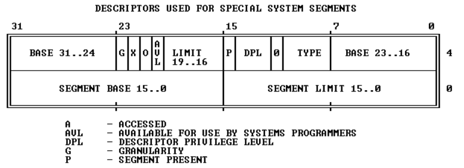
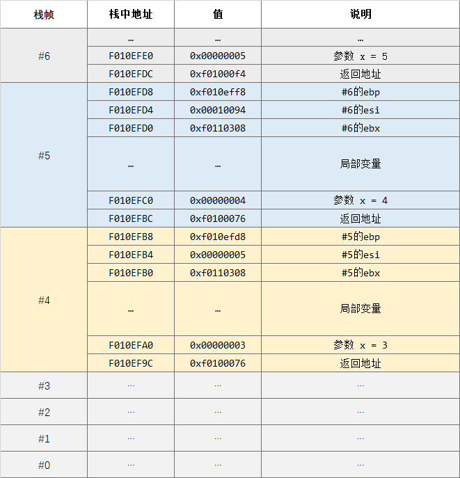

# MIT CS6.828-Lab 1: Booting a PC

## Part 1: PC Bootstrap

### 0. 前置知识

#### x86、i386、x86-64

**x86**，又称 **IA-32**（Intel Architecture, 32-bit），泛指一系列基于Intel 8086且向后兼容的中央处理器指令集架构。这个名称源于这个系列早期的处理器名称，它们都是`80x86`格式，如`8086`、`80186`、`80286`等。

**需要特别指出的是**，x86系列的第一款芯片`8086`支持16位运算（即运算器一次最多能处理16位长的数据、寄存器最大长度为16位、寄存器和运算器之间的数据通路为16位），但有20位地址总线，即可寻址内存大小为 1MB。

**i386** 是`80386`处理器的别名，但一般来说”适用于 i386“等同于"适用于i386采用的架构 x86"，因此在相关语境下将 **i386** 视为指代 **x86** 架构也是可以的

**x86-64** 是基于 x86 的 64 位扩展架构。一般说 **x86** 是 32 位架构（虽然最初两代CPU是16位的），将该架构扩展至 64 位是AMD先于Intel完成的，并命名为 **AMD 64**，Intel随后才推出与 **AMD 64** 架构兼容的处理器，并命名为 **Intel 64**，即 **x86-64**。

（注：x86=IA-32，但 x86-64≠IA-64，IA-64 是全新的架构，与 x86 完全没有相似性）

#### 汇编指令格式：AT&T 

实验中 GDB 调试显示的汇编代码都是 AT&T 格式。对于本实验而言，有汇编基础再好不过，但如果没有，也没必要完整学一遍再来，对下列常用语法格式有个大致印象就够用了，出现陌生语法再查。

```assembly
pushb %eax 
# 将寄存器eax的值压栈。寄存器名前要加%，后缀b表示操作数字长为低8位
pushb $1 # 将十六进制数1压栈。直接给出数值（称为立即数）时要在前面加$
```

```assembly
addl $1, %eax 
#将寄存器eax的值+1后结果存入eax，后缀l表示操作数字长为全部32位
movw %ebx, %eax
#将寄存器ebx的值赋给寄存器eax，后缀w表示操作数字长为低16位
```

#### 实模式与保护模式

**实模式**

x86 系列的第一代芯片`8086` 是 16 位处理器，有 20 根地址线，只支持`1MB`内存空间寻址。 x86 架构是向后兼容的，为了保证当初基于`8086`设计的程序在如今普遍内存大小为`4GB`的 x86 计算机中还能正常运行，必须将这初始的`1MB`保留下来，且当年`8086`在这`1MB`内存空间里遵循的一些规则，后续的 x86 系列芯片也必须遵循。

这`1MB`空间以及在这空间内采用的寻址方式、地址长度等等当年`8086`遵循的规定，就是**实模式**。

显然当年`8086`加电执行的第一条指令只能存储在这`1MB`中，因此后来的 x86 芯片加电执行的第一条指令也必然存储在这`1MB`空间中，这已成为设计规范以保证向后兼容性。也就是说，x86 系列芯片加电后都首先进入实模式，完成与当年`8086`开机引导类似的操作后，再打开某个开关，启用这`1MB`以外的地址空间，从实模式切换到**保护模式**。

- 寻址空间

  实模式下，寻址空间为`1MB`，具体的地址范围为`0x00000`到`0xFFFFF`；

- 地址计算方式

  由于`8086`的寄存器是 16 位长的，要表示 20 位长的地址，要使用`cs`和`ip`两个寄存器，地址计算方式如下：

  物理地址  = 段基址(cs) × 16 + 段内偏移量(ip)

  即使后来的 x86 芯片的寄存器有 32 位长，足够存储完整地址，在实模式下也必须按照上述方式进行地址存储和计算。

- 寄存器

  - 通用寄存器

    x86 系列芯片的通用寄存器都有 8 个，名称及特定用途都沿用自初代芯片`8086`。后来芯片位数扩展到 32 位，通用寄存器也相应扩展到 32 位，在原来名称的基础上开头加了`E`，与`8086`的 16 位寄存器相区别。

    - EAX：一般用作累加器（Add）
    - EBX：一般用作基址寄存器（Base）
    - ECX：一般用来计数（Count）
    - EDX：一般用来存放数据（Data）
    - ESP：一般用作堆栈指针（Stack Pointer）
    - EBP：一般用作基址指针（Base Pointer）
    - ESI：一般用作源变址（Source Index）
    - EDI：一般用作目标变址（Destinatin Index）

  - 状态寄存器
    - EFLAGS：状态标志寄存器。分为CF、ZF、SF、OF等状态位。
    - DF：Direction Flag。设置DF标志使得串指令自动递减（从高地址向低地址方向处理字符串），清除该标志则使得串指令自动递增。STD以及CLD指令分别用于设置以及清除DF标志。
  - 段寄存器
    - CS (Code Segment)：代码段寄存器；
    - DS (Data Segment)：数据段寄存器；
    - SS (Stack Segment)：堆栈段寄存器；在16位下与SP寄存器组合使用，SS:SP作为栈顶指针；在32位下ESP寄存器足够作为栈顶指针，SS就无关紧要了。
    - ES (Extra Segment)：附加段寄存器；

**保护模式**

`8086`、`80186`都是 16 位处理器、20位物理地址，没有虚拟内存的概念，每一个地址都能在存储芯片中一一对应地找到物理存储单元，必须也只能运行在实模式下。

从`80286`（16位处理器）开始有了虚拟内存，为了进行虚拟内存管理，从早先的**段基址**寄存器演化出专门的**段表**，寻址方式也不再遵循实模式下的计算方式，需要从实模式中区分出来，因此有了 **16 位保护模式**。

从`80386`开始，处理器都为 32 位，对应引入了 **32 位保护模式**。Windows 2000 、Windows XP 都是在 32 位保护模式下运行的。

保护模式下，寻址范围不再受制于实模式下的 `1MB`，地址计算方式也有所不同。

### 1. 试运行 JOS

1. 下载 Lab 1 源码：`git clone https://pdos.csail.mit.edu/6.828/2018/jos.git lab`

2. 构建 JOS 镜像：

   ```bash
   $ cd lab && make
   # 应显示以下信息
   + as kern/entry.S
   + cc kern/entrypgdir.c
   + cc kern/init.c
   + cc kern/console.c
   + cc kern/monitor.c
   + cc kern/printf.c
   + cc kern/kdebug.c
   + cc lib/printfmt.c
   + cc lib/readline.c
   + cc lib/string.c
   + ld obj/kern/kernel
   ld: warning: section `.bss' type changed to PROGBITS
   + as boot/boot.S
   + cc -Os boot/main.c
   + ld boot/boot
   boot block is 396 bytes (max 510)
   + mk obj/kern/kernel.img
   ```

3. 运行JOS：`make qemu`（注：如果用的Linux是云服务器之类的没有图形界面只有命令行，使用`make qemu-nox`）

   

   按`Ctrl+a x`退出 JOS

4. 到这一步说明 Lab 1 的环境配置已经完成了，我们接下来的任务就是以这个只有简单功能的 OS 作为研究对象，分析 CPU 从加电执行第一条指令开始到加载 JOS 的过程。

### 2. 使用 GDB 研究 PC 启动的第一步

打开一个shell窗口，执行

```bash
cd lab && make qemu-gdb #如果没有图形界面，使用make qemu-nox-gdb
```

再开一个shell窗口，执行

```bash
cd lab && make gdb
```

应显示以下信息

```bash
$ cd lab && make gdb
gdb -n -x .gdbinit # GDB 的启动配置文件，由 lab 提供
... # 一堆 GDB 的版本及介绍信息
The target architecture is set to "i8086".
# JOS 系统程序的第一条指令
[f000:fff0]    0xffff0:	ljmp   $0xf000,$0xe05b
0x0000fff0 in ?? ()
+ symbol-file obj/kern/kernel
```

> 注意！如果你的第一条指令是0xffff0:	ljmp   \$0x3630,$0xf000e05b，说明 GDB 以32位而不是16位来解释，这个问题的出现可能是因为你使用的是apt-get安装的QEMU而非6.828课程提供的定制版QEMU，强烈建议使用后者。

在分析第一条指令在做什么之前，需要先搞清楚我们正在什么样的硬件环境里。

我们用QEMU模拟了一个与 i386 相同的硬件环境，并在此硬件环境上加载 JOS。而 i386 采用 x86 架构。因为 x86 架构向后兼容，所以有一些”设定“继承自 x86 系列最早的处理器 `8086`。

（下面的地址都用8位16进制数表示，可表示的内存大小为4GB，这是目前<呃，好像也过时了>我们所用计算机的普遍内存大小，也是 i386 的物理寻址空间大小）

前面提过，`8086`的寻址空间大小为`1MB `。因此在这里需要理解的第一个古老”设定“是，从`0x00000000`开始，到`0x00FFFFFF`结束的这`1MB`大小空间是特殊的，保留用作特定用途。（这样一来，当年基于 8086 这 1MB 内存而编写的程序，在如今的最新 x86 架构上也能正常运行，因为这 1MB 空间依然是和当年一样的用途）

这`1MB`被分为各个区域，分别用作特定用途，如下图所示：

```
+------------------+  <- 0x00100000 (1MB) (注：1MB空间最后一个地址0x000FFFFF)
|     BIOS ROM     |
+------------------+  <- 0x000F0000 (960KB)
|  16-bit devices, |
|  expansion ROMs  |
+------------------+  <- 0x000C0000 (768KB)
|   VGA Display    |
+------------------+  <- 0x000A0000 (640KB)
|                  |
|    Low Memory    |
|                  |
+------------------+  <- 0x00000000
```

其中，需要我们特别关注的是`0x000F0000`到`0x000FFFFF`这 64 KB 空间。对于早期 PC ，BIOS 存储在 ROM 中，这 64 KB 就是在 ROM 中的寻址空间。

BIOS 是 CPU 加电后执行的第一个程序，前面显示的`[f000:fff0] 0xffff0: ljmp $0xf000,$0xe05b`就是 BIOS 的第一条指令。

我们目前所处的位置及要分析的内容，就是QEMU模拟出来的 80386 芯片加电后启动的第一步：执行BIOS。

现在来分析第一条指令：

`[f000:fff0] 0xffff0: ljmp $0xf000,$0xe05b`

- `[f000:fff0]`：`f000`是寄存器`cs`的值，`fff0`是寄存器`ip`的值。
- `0xffff0`：指令的起始地址。我们知道 BIOS 所在区域的地址最大为`0xfffff`（这里省略了高位的0），说明第一条指令存放在这块内存区域的最顶端`0xffff0`到`0xfffff`，指令长度为16字节（注意，这里说的是机器码的长度，而非我们看见的汇编指令的长度）。
- `ljmp $0xf000,$0xe05b`：汇编指令，`ljmp`为转移指令，`l`表示目标地址为16位地址，后面两个立即数中，`$0xf000`是给寄存器`cs`的值，`$0xe05b`是给寄存器`ip`的值。

`cs`、`ip`这两个寄存器的值与实际地址之间是什么关系？

前面提到，第一条指令的地址之所以是`0xffff0`，是因为第一代 x86 CPU `8086` 就是如此。实际上，在这 `1MB` 内存区域内进行的操作，都得遵循当年`8086`的规则（此时所处的就是所谓的**实模式**） 。而`8086` 是 16 位处理器，却有 20 根地址线，地址长度为 20 位。为了能用 16 位的寄存器表示 20 位的地址，`8086`使用以下转换公式进行转换：

物理地址  = 段基址(cs) × 16 + 段内偏移量(ip)

事实上，乘法对于CPU来说是很复杂的，所以 ×16 的操作实际是通过将值左移4位来实现的，即：

物理地址 = 段基址(cs) << 4 + 段内偏移量(ip)

`f000`左移4位就变成了`f0000`（别忘了十六进制和二进制之间是如何转换的），再加上`fff0`，就变成了 GDB 显示的地址 `ffff0`。

同理，我们可以计算出这条`ljmp`指令的跳转目标地址：`f0000`+`e05b`=`fe05b`。

综上，我们知道了QEMU模拟的这个`i386` 机器在按下电源键之后干的第一件事：CPU读取并执行起始地址为`0xffff0`处的（这个地址初始设定是由硬件完成的）、属于 BIOS 程序的第一条指令：跳转到地址`0xfe05b`。

---

**练习2：使用 GDB 的 si（步骤指令）命令跟踪 ROM BIOS 以获取更多指令，并尝试猜测它可能在做什么。您可能需要查看 [Phil Storrs I/O 端口说明](http://web.archive.org/web/20040404164813/members.iweb.net.au/~pstorr/pcbook/book2/book2.htm)以及 [6.828 参考资料页面](https://pdos.csail.mit.edu/6.828/2018/reference.html)上的其他资料。无需了解所有细节 - 只需大致了解 BIOS 首先要做什么。**

```assembly
[f000:fff0]    0xffff0:	ljmp   $0xf000,$0xe05b 
# 第一条指令，跳转至地址0xfe05b
[f000:e05b]    0xfe05b:	cmpl   $0x0,%cs:0x6ac8
# 判断地址0xf6ac8处的值是否等于0，若等于0则置状态字寄存器中的ZF位为1
[f000:e062]    0xfe062:	jne    0xfd2e1
# 若上一条指令的结果不为0/不相等（jne = jump not equal）则跳转至地址0xfd2e1
[f000:e066]    0xfe066:	xor    %dx,%dx
#（由地址可以看出上条指令没有跳转）将寄存器dx清零
[f000:e068]    0xfe068:	mov    %dx,%ss
[f000:e06a]    0xfe06a:	mov    $0x7000,%esp
# 将寄存器ss清零
# 将寄存器esp的值置为0x7000
# 类似于cs:ip的地址表示方法，实模式下ss:sp表示栈顶地址，此时被初始化为0x70000
# esp的e只是表明这是个32位寄存器，与sp是同一个东西
[f000:e070]    0xfe070:	mov    $0xf34c2,%edx
# 将寄存器edx的值设为0xf34c2
[f000:e076]    0xfe076:	jmp    0xfd15c
# 跳转到地址0xfd15c
[f000:d15c]    0xfd15c:	mov    %eax,%ecx
# ？
[f000:d15f]    0xfd15f:	cli
# 关中断
[f000:d160]    0xfd160:	cld 
# 将DF置0，使得字符串指针在每次字符串操作后自动递增
...
```

BIOS程序执行时，会建立一个中断描述符表并初始化各种设备，例如 VGA 显示器。这就是 QEMU 窗口中看到的“ `Starting SeaBIOS` ”消息的来源。初始化 PCI 总线和 BIOS 知道的所有重要设备后，它会搜索可引导设备（即操作系统存储的设备），如软盘（已经淘汰了的远古存储设备）、硬盘或 CD-ROM（光盘）。最终，当它找到可引导磁盘时，BIOS 从磁盘读取**引导加载程序**（Boot Loader）并将CPU控制权转交给它（即CPU开始执行引导加载程序的指令）。

## Part 2: The Boot Loader

### 1. 从 Boot Loader 开始

BOIS从磁盘读取Boot Loader到指定内存区域`0x7c00`到`0x7dff`（512KB），然后执行`jmp`指令，跳转到Boot Loader的第一条指令所在地址`0x7c00`。

```bash
(gdb) b *0x7c00 #在地址0x7c00处打断点
Breakpoint 1 at 0x7c00
(gdb) c #执行到下一个断点后停止
Continuing.
The target architecture is set to "i8086".
[   0:7c00] => 0x7c00:	cli #0x7c00地址处的指令
```

Boot Loader并非是操作系统的一部分，各类操作系统可以有自己的Boot Loader，但一种Boot Loader也可以支持加载多种操作系统，如`GNU GRUB`。

### 2. boot.S：从实模式切换到保护模式

---

**练习 3(1) 在地址 0x7c00 处设置断点，这是加载引导扇区的位置。继续执行直到该断点。跟踪`boot/boot.S`中的代码，使用源代码和反汇编文件 `obj/boot/boot.asm`来跟踪您的位置。还使用 GDB 中的`x/i`命令反汇编引导加载程序中的指令序列，并将原始引导加载程序源代码与`obj/boot/boot.asm` 和 GDB 中的反汇编进行比较。**

---

加载 JOS 的 Boot Loader 的源程序代码位于`/lab/boot/boot.S`和`/lab/boot/main.c`中。在`boot.S`的末尾会调用`main.c`的代码以继续执行。

首先执行的是`boot.S`。其中`cli`一行即是被加载到`0x7c00`处的Boot Loader第一条指令。`.`开头的指令是**汇编伪指令**，没有对应的机器码，只用于提供汇编信息。

`boot.S`中实现从实模式到保护模式的切换，大致分为 4 个步骤：关中断→使能 A20 地址线 → 加载 GDT →  将控制寄存器中CR0段的PE位置1，切换到保护模式。

#### 2.1 关中断

```assembly
#include <inc/mmu.h>

# Boot Loader，完成从实模式到保护模式的切换，并最终跳转至内核加载程序

# .set 给一个全局变量或局部变量赋值
.set PROT_MODE_CSEG, 0x8         # kernel code segment selector
.set PROT_MODE_DSEG, 0x10        # kernel data segment selector
.set CR0_PE_ON,      0x1         # protected mode enable flag

# 使符号start对整个工程可见
.globl start
start:
  # 第一步，关中断（保证以下工作不会被其他程序打断，若被打断，会导致CPU发生异常）
  .code16                     # Assemble for 16-bit mode
  cli                         # Disable interrupts 关中断
  cld                         # String operations increment

  # Set up the important data segment registers (DS, ES, SS).
  # 将 ds/es/ss 寄存器全部置零
  xorw    %ax,%ax             # Segment number zero
  movw    %ax,%ds             # -> Data Segment
  movw    %ax,%es             # -> Extra Segment
  movw    %ax,%ss             # -> Stack Segment
```

#### 2.2 使能 A20 地址线

为什么要使能 A20 地址线？为什么是通过向键盘控制器端口写入数据来使能 A20 地址线？其实基本上都是历史原因，是因为当年的程序员根据当时的硬件条件这么设计的。

对于8086，20根地址线为A0~A19，A20固定为0，这样使得超出0xFFFFF范围的地址会自动对0xFFFFF取模，如地址0x100000会自动变为0x00000，这称为**地址环绕**。

要使用 1MB 以外的内存空间，需要使能 A20 地址线，以突破地址环绕。

由于历史原因，A20线由8042键盘控制器芯片（这个芯片仍在如今的计算机主板上）控制。

0x64是8042的状态寄存器（这里可能需要一点CPU与I/O端口交互的前置知识），寄存器的最低位（第0bit）代表输出缓冲区状态，第1bit代表输入缓冲区状态，0空1满

CPU通过8042启用A20的固定流程是：CPU将命令0xd1写入0x64端口→将启用A20的固定值0xdf写入0x60端口

 ```assembly
 seta20.1: # 启用A20的第一步
   inb     $0x64,%al               # Wait for not busy
   # in指令，从0x64端口读取低8位数据到寄存器al（即ax的低8位）
   testb   $0x2,%al
   # testb即对操作数的与运算，这里是判断al的第1个bit是否为0
   # 即检查8042的输入缓冲区状态是否为空
   # 若为0，则状态寄存器中ZF位置1；若为1，则ZF置0
   jnz     seta20.1
   # 根据ZF位结果得知testb结果是否为0
   # 若8042输入缓冲区不为空，则跳转回起始位置，循环检查，直到8042输入缓冲区为空

   movb    $0xd1,%al               # 0xd1 -> port 0x64
   outb    %al,$0x64
   # 8042输入缓冲区空，写入命令0xd1（当CPU操作为写入时，0x64代表8042的命令寄存器；为读入时，0x64代表8042的状态寄存器），
   # 0xd1命令表示将下一个字节写入输出端口

 seta20.2: # 启用A20的第二步
   inb     $0x64,%al               # Wait for not busy
   testb   $0x2,%al
   jnz     seta20.2
   # 同上，循环判断8042输入缓冲区是否为空

   movb    $0xdf,%al               # 0xdf -> port 0x60
   outb    %al,$0x60
   # 将数据0xdf写入8042的数据端口0x60（中的输出端口）
   # --------- 完成对A20的使能 ----------
 ```

#### 2.3 加载 GDTR

`lgdt`指令：将自定义的GDT（gdtdesc定义在本文件最后）加载到GDT寄存器（GDTR）中。后面还会用到 GDT，所以对 GDT 内容的解释放在后文。

gdtdesc需要有两个属性：GDT 基址与限制（表格大小，单位字节）

```assembly
# boot.S 末尾定义GDT表
# Bootstrap GDT
.p2align 2                                # force 4 byte alignment
gdt:
  SEG_NULL				# null seg
  SEG(STA_X|STA_R, 0x0, 0xffffffff)	# code seg
  SEG(STA_W, 0x0, 0xffffffff)	        # data seg

gdtdesc:
  .word   0x17                            # sizeof(gdt) - 1
  .long   gdt                             # address gdt
```

这一步代码可以理解为将全局段表加载到段表基址寄存器中。

 ```assembly
   lgdt    gdtdesc
 ```

注意：到这一步为止，GDT加载仍未全部完成。`boot.S`在切换到保护模式后会继续进行这项工作。

#### 2.4 PE位置1，切换到保护模式

在80386中，控制寄存器CR大小16字节，均分为4部分：CR0、CR1、CR2、CR3，如下图所示（详见[Intel 80386 Reference Programmer's Manual Table of Contents - 4.1 Systems Registers](https://pdos.csail.mit.edu/6.828/2018/readings/i386/s04_01.htm)）


其中CR0的第0~4位、第31位是系统控制标志，其余位为保留位

CR0的第0位为PE位，将PE置1，从实模式切换到保护模式

 ```assembly
   movl    %cr0, %eax # 不能直接修改CR0的值，只能通过MOV到通用寄存器修改
   orl     $CR0_PE_ON, %eax # 全局变量CR0_PE_ON=0x1，在文件开头定义；将PE位置1
   movl    %eax, %cr0 # 赋值给CR0
   # --------- 完成CR0中PE位的置位 ----------
   # ---------- 现在已处于保护模式 ----------
 ```

#### 2.5 可能会有的问题：这些步骤是必须的吗？顺序可以颠倒吗？

我们发现，（从形式上）从实模式切换到保护模式其实只有一步：将PE位置1。

那么另外两个步骤呢？它们是必须的吗？一定要在PE位置1前完成吗？

我Google完得出的初步结论是：

- 关中断`cli`是必须的，且要首先执行。

- `lgdt gdtdesc`是必须的，且一定要在PE位置1前进行，但GDT加载的后续工作（如跳转和重新加载段寄存器）可以在之后再做。
- 使能 A20 不是必须的，且在实模式下和保护模式下都可以做。但如果不使能，会导致奇数兆字节无法访问，如访问1-2mb会变成访问0-1mb，访问3-4mb会变成访问2-3mb

参考：

- [Why enable A20 line in Protected Mode?](https://stackoverflow.com/questions/33827474/why-enable-a20-line-in-protected-mode)
- [How to switch from real mode to protected mode after bootloader?](https://stackoverflow.com/questions/36968829/how-to-switch-from-real-mode-to-protected-mode-after-bootloader)
- [16位实模式切换32位保护模式过程详解](https://bbs.kanxue.com/thread-269223.htm#msg_header_h2_0)

### 3. boot.S：GDT加载-跳转与段式地址转换

#### 3.1 为什么必须跳转

在` lgdt gdtdesc`之后，还要继续进行 GDT 加载工作。因为这一指令只是将自定义的 GDT 表信息保存到了 GDTR。切换到保护模式之后，要指定一段代码的起始地址，不能像实模式那样直接给出一个完整的物理内存地址，而是要用到 GDT 进行地址转换。

为了让 CPU 寻址时能够使用 GDT ，必须重新加载所有的段寄存器。CS 是其中之一。但 CS 是特别的，它不能简单地通过`mov`指令修改，而需要通过`jump`。所以`boot.S`在此处有一个`ljmp`指令，后面是一堆`mov`指令以修改其他的段寄存器。

```assembly
  ljmp    $PROT_MODE_CSEG, $protcseg
  # PROT_MODE_CSEG = 0x08 为段选择子，protcseg 为段内偏移量0x7c32（由编译器给出？）
  # CS 中的值被置为 0x08
  # 由于处在保护模式下，CPU不进行实模式下地址=CS<<4+IP的计算，而是进行段式的地址转换：根据0x08从GDT找到1号描述符，对应段基址为0x0，与段内偏移量0x7c32相加即完整地址0x7c32
  # 跳转至地址为0x7c32
```

#### 3.2 利用GDT完成段式地址转换

这里进一步研究地址转换具体是如何完成的：

如果学过段式内存管理，就很容易理解这么一个笼统的转换过程：程序给出一个逻辑地址，再根据逻辑地址的某几位，在段表中找到对应的项（物理地址），再与逻辑地址中的段内偏移量拼接起来，得到完整的物理地址。

在这行代码中，`protcseg`是段内偏移量，它由编译器给出（？）

`PROT_MODE_CSEG = 0x8`在文件开头定义，这是一个 Segment Selector （段选择器/段选择子），是逻辑地址的一部分，需要根据它在 GDT（段表） 中找到对应的项。

Segment Selector 固定16位长，各位含义如下图所示：（详见[Intel 80386 Reference Programmer's Manual Table of Contents - 5.1 Segment Translation](https://pdos.csail.mit.edu/6.828/2018/readings/i386/s05_01.htm)）


- INDEX：理解为段号即可，要根据段号在段表中找到对应的段表项。正式地，CPU 根据这个 12 位长的 INDEX 在描述符表（GDT或LDT）中找到对应的 8 字节长的一个描述符。描述符表最多可包含 8192 个描述符，所以 INDEX 有 12 位。查询时，CPU 简单地将 INDEX 乘 8 ，再加上描述符表的基址，就得到了段表项的地址。
- TABLE INDICATOR：指明应该在哪个描述符表里找描述符。0 = GDT，1 = LDT。
- RPL：用于内存保护的字段，0 = 内核级，1 = 系统服务级，2 = 自定义扩展级， 3 = 应用级

`PROT_MODE_CSEG = 0x8`，即 `0000 1000`，INDEX = 1，TI = 0，RPL=0。可知对应描述符是 GDT 的 1 号描述符（注：GDT 中 INDEX=0 的表项是不使用的）。

GDT 的 1 号描述符的内容是什么？在切换到保护模式之前，我们加载了 GDT ，而 GDT 的内容是 `boot.S` 自己初始化的，即文件末的这段定义：

```assembly
gdt:  
  SEG_NULL				# null seg 0号表项，不使用
  SEG(STA_X|STA_R, 0x0, 0xffffffff)	# code seg 1号表项
  SEG(STA_W, 0x0, 0xffffffff)	    # data seg 2号表项
```

1 号描述符的内容是`SEG(STA_X|STA_R, 0x0, 0xffffffff)`，实际上是使用了`/lab/inc/mmu.h`中的宏定义：

```c
#define SEG(type,base,lim)					\
	.word (((lim) >> 12) & 0xffff), ((base) & 0xffff);	\
	.byte (((base) >> 16) & 0xff), (0x90 | (type)),		\
		(0xC0 | (((lim) >> 28) & 0xf)), (((base) >> 24) & 0xff)
```

这段宏定义的功能是根据`type`（段类型）、`base`（段基址）、`lim`（段长）这三个参数去构造实际的 8 字节长的段描述符。

之所以要写成这么难看的样子，是因为段描述符的格式就是这么难看……比如32位的段基址不是连续的32位存储，而是分散在三个部分。这属于历史遗留问题。完整的 8 字节段描述符格式见下图：



这里我们知道了 1 号描述符中保存的段基址是`0x0`。与段内偏移量`0x7c32`拼接，即得到完整内存地址`0x7c32`，即 GDB 给出的结果：

```bash
(gdb) x/i
   0x7c2d:	ljmp   $0x8,$0x7c32
(gdb) x/i
   0x7c32:	mov    $0xd88e0010,%eax
```

### 4. boot.S：GDT加载-重新加载段寄存器

80386 有 6 个段寄存器：CS、DS、SS、ES、FS、GS。

其中 CS 已通过`ljmp $PROT_MODE_CSEG, $protcseg`指令将值重新加载为`0x08`，即内核代码段基址。

剩下的5个寄存器都可通过`mov`指令将值重新加载为`PROT_MODE_DSEG = 0x10`，这是内核数据段基址。

段寄存器重新加载完毕后，后续的指令地址、数据地址都可以通过 GDT 完成地址转换了以正确访问了。

```assembly
  .code32                     # Assemble for 32-bit mode
protcseg:
  # Set up the protected-mode data segment registers
  movw    $PROT_MODE_DSEG, %ax    # Our data segment selector
  movw    %ax, %ds                # -> DS: Data Segment
  movw    %ax, %es                # -> ES: Extra Segment
  movw    %ax, %fs                # -> FS
  movw    %ax, %gs                # -> GS
  movw    %ax, %ss                # -> SS: Stack Segment
  
  # Set up the stack pointer and call into C.
  movl    $start, %esp # ?完全不明白为什么要把0x7c00作为栈顶
  call bootmain # 执行/lab/boot/main.c的代码，继续Boot Loader
  
   # If bootmain returns (it shouldn't), loop.
spin:
  jmp spin
```

### 5. main.c：加载内核

---

**练习3(2) 跟踪到`boot/main.c`中的`bootmain()`，然后跟踪到`readsect()`。确定与`readsect()`中的每个语句相对应的确切汇编指令。跟踪`readsect()`的其余部分并返回到`bootmain()` ，并确定从磁盘读取内核剩余扇区的`for`循环的开始和结束。找出循环结束时将运行的代码，在那里设置断点，然后执行到该断点。然后逐步执行引导加载程序的其余部分。**

---

`boot.S`完成了无法用高级语言代码完成的工作（应该？），当 GDT 及段寄存器准备好之后，C语言代码运行的环境也就准备好了，Boot Loader的工作由`main.c`接力完成。（什么？继续用汇编？不要为难自己……）

#### 5.1 读取、校验、执行ELF文件

一个C程序经过编译和链接后会产生二进制可执行文件，ELF是二进制文件的一种格式。

首先来看 ELF 文件的结构：

|    名称     |                             用途                             |
| :---------: | :----------------------------------------------------------: |
|  ELF 首部   | 校验、指出Section Header table（以下各个字段都是这个表格的一部分）相对于文件起始的偏移量、Section Header table的大小等 |
| .text 字段  |                       保存程序的源代码                       |
| .rodata字段 |                        保存只读的变量                        |
| .data 字段  |              保存已经初始化的全局变量和局部变量              |
|  .bss 字段  |               保存未初始化的全局变量和局部变量               |
|    ....     |                             ....                             |

在本实验中，JOS 内核（一个C程序）在执行`make`之后编译产生了可执行文件`/lab/obj/kern/kernel.img`，它是 ELF 格式的。在 QEMU 模拟出的硬件环境中，这个ELF文件被视为存储在了硬盘上。（就好比用U盘重装系统，得事先拷个系统镜像在U盘上才能装） 

`bootmain`函数要做的第一件事，是调用`readseg`来读入硬盘上的ELF文件的第一页数据（大小为 512*8B = 4KB）（将 ELF 首部包含在内，可能读多了，但不影响）。 

从下面代码可以看到，**读入的 ELF 数据在内存中的起始地址为`0x10000`**.

```c
#define SECTSIZE	512
#define ELFHDR		((struct Elf *) 0x10000) // scratch space 
// read 1st page off disk
readseg((uint32_t) ELFHDR, SECTSIZE*8, 0);
// 将ELF文件从起始地址偏移0个字节后的连续512*8个字节数据读入到以ELFHDR为起始物理地址的内存中
```

根据ELF规范，对读入的数据进行校验，判断是否为合法的ELF文件：

```c
// is this a valid ELF?
if (ELFHDR->e_magic != ELF_MAGIC) 
    // 判断文件是否以规定的固定值 0x464C457FU 开头
    // （注：/ "\x7FELF" in little endian */*）
    goto bad;
```

如果是合法的ELF文件，则继续读取ELF的余下内容：

1. 找到并读取Program Header Table。这个表格保存了程序所有段的信息，读取这个表，就是读取程序的指令段、数据段等等。

    ```c
    // load each program segment (ignores ph flags)
    ph = (struct Proghdr *) ((uint8_t *) ELFHDR + ELFHDR->e_phoff);
    // e_phoff是ELF文件中的一个字段，用于指出Program Header Table的起始位置
    eph = ph + ELFHDR->e_phnum;
    // e_phnum用于指出Program Header Table中有多少个entries
    // 计算得出eph，即Program Header Table的结束位置
    for (; ph < eph; ph++)
        // p_pa is the load address of this segment (as well
        // as the physical address)
        readseg(ph->p_pa, ph->p_memsz, ph->p_offset);
    // 读取所有段到内存中
    ```

2. 开始执行ELF中的指令，正式运行内核。

   ```c
   // call the entry point from the ELF header
   // note: does not return!
   ((void (*)(void)) (ELFHDR->e_entry))();
   // e_entry字段指向的是这个文件的执行入口地址
   // CPU开始执行这个二进制文件，也即计算机开始运行JOS
   ```

这里还可以进一步看看内核的第一条指令在哪里：

上面一行代码对应的汇编结果是（在`/lab/obj/boot/boot.asm`中）：`7d71: ff 15 18 00 01 00   call  *0x10018`。以内存地址`0x10018`所存储的值为目标地址进行跳转。

为什么是`0x10018`？前面加粗过，读入的 ELF 文件以`0x10000`为起始地址。根据 ELF 规范，从起始地址向后偏移`0x18`个字节，即地址`0x10018`为`e_entry`字段，保存的是程序执行的入口点（entry point）。

在 GDB 中查看内存地址`0x10018`中的值：

```bash
(gdb) b *0x7d71
(gdb) c # 记得先执行到已经把ELF文件加载完毕的位置
(gdb) x/1x 0x10018
0x10018:	0x0010000c
```

即内核的第一条指令位于`0x10000c`中。

#### 5.2 `readsect`函数分析

`bootmain`函数调用`readseg`函数进行ELF文件的读取，每调用一次读取一段（eg. ELF文件首部、代码段、数据段等），而`readseg`又调用了`readsect`进行一个扇区的读取（一个程序段可能存储在连续多个扇区）。

练习 3 要求我们深入`readsect`函数，将 C 源代码与汇编指令对应起来。

从`/lab/obj/boot/boot.asm`文件可知，`readsect`函数的起始地址为`0x00007c78`。补充的注释是汇编指令对应的C源码。

```assembly
(gdb) b *0x7c78
Breakpoint 1 at 0x7c78
(gdb) c
Continuing.
The target architecture is set to "i386".
=> 0x7c78:      push   %ebp
Breakpoint 1, 0x00007c78 in ?? ()
(gdb) x/37i
   # readsect函数开始，以下是汇编中call指令前后的固定的栈操作，用于分隔调用者和被调用者的栈空间
   0x7c79:      mov    %esp,%ebp
   0x7c7b:      push   %edi
   0x7c7c:      push   %eax
   0x7c7d:      mov    0xc(%ebp),%ecx
   # // wait for disk to be ready
   # waitdisk();
   0x7c80:      call   0x7c6a  # 调用 waitdisk 函数
   # outb(0x1F2, 1);		// count = 1
   0x7c85:      mov    $0x1,%al
   0x7c87:      mov    $0x1f2,%edx
   0x7c8c:      out    %al,(%dx)
   # outb(0x1F3, offset);
   0x7c8d:      mov    $0x1f3,%edx
   0x7c92:      mov    %ecx,%eax
   0x7c94:      out    %al,(%dx)
   # outb(0x1F4, offset >> 8);
   0x7c95:      mov    %ecx,%eax
   0x7c97:      mov    $0x1f4,%edx
   0x7c9c:      shr    $0x8,%eax
   0x7c9f:      out    %al,(%dx)
   # outb(0x1F5, offset >> 16);
   0x7ca0:      mov    %ecx,%eax
   0x7ca2:      mov    $0x1f5,%edx
   0x7ca7:      shr    $0x10,%eax
   0x7caa:      out    %al,(%dx)
   # outb(0x1F6, (offset >> 24) | 0xE0);
   0x7cab:      mov    %ecx,%eax
   0x7cad:      mov    $0x1f6,%edx
   0x7cb2:      shr    $0x18,%eax
   0x7cb5:      or     $0xffffffe0,%eax
   0x7cb8:      out    %al,(%dx)
   # outb(0x1F7, 0x20);	// cmd 0x20 - read sectors
   0x7cb9:      mov    $0x20,%al
   0x7cbb:      mov    $0x1f7,%edx
   0x7cc0:      out    %al,(%dx)
   # // wait for disk to be ready
   #	waitdisk();
   0x7cc1:      call   0x7c6a # 调用 waitdisk 函数
   # // read a sector
   # insl(0x1F0, dst, SECTSIZE/4);
   0x7cc6:      mov    $0x80,%ecx
   0x7ccb:      mov    0x8(%ebp),%edi
   0x7cce:      mov    $0x1f0,%edx
   0x7cd3:      cld    
   0x7cd4:      repnz insl (%dx),%es:(%edi)
   # readsect函数返回，以下是汇编中call指令前后的固定的栈操作，用于分隔调用者和被调用者的栈空间
   0x7cd6:      pop    %edx
   0x7cd7:      pop    %edi
   0x7cd8:      pop    %ebp
   0x7cd9:      ret
```

顺便也看一下`readsect`函数具体是如何读磁盘的。可以简单概括为4步：

1. 查询磁盘状态是否空闲（具体实现是判断磁盘I/O状态端口`01F7`的bit 7<为1则磁盘正在执行命令，忙碌中>与bit 6<为1则表示设备就绪>是否分别为0和1）；
2. 若空闲，则将要读的扇区信息（从第几号扇区开始读、读几个等）写入端口`0x1F3`到`0x1F6`，并将命令`0x20`（表示读扇区）写入磁盘的I/O命令端口`01F7`；
3. 查询磁盘状态是否空闲；
4. 若空闲，则从磁盘I/O数据端口`0x1F0`读入数据；

关于此处用到的磁盘I/O端口号及对应用途，详见[XT, AT and PS/2 I/O port addresses](https://bochs.sourceforge.io/techspec/PORTS.LST)（搜索关键词1st Fixed Disk Controller）

---

**练习3的问题：**

- **处理器什么时候开始执行 32 位代码？究竟是什么导致从 16 位模式切换到 32 位模式？**

  在`boot.S`的`  ljmp $PROT_MODE_CSEG, $protcseg`处开始执行代码。

  从 16 位模式切换到 32 位保护模式，既要求 PE 标志位的修改，也要求 GDT 加载完毕（否则只是在形式上切换到了保护模式下而已，没办法实际进行保护模式下的寻址、执行代码），所以是以下指令合起来完成了从 16 位模式到 32 位模式的切换。

  ```assembly
    # 加载GDT到GDTR
    lgdt    gdtdesc
    # 修改PE标志位
    movl    %cr0, %eax
    orl     $CR0_PE_ON, %eax
    movl    %eax, %cr0
    # Jump to next instruction, but in 32-bit code segment.
    # Switches processor into 32-bit mode.
    # 更新全部的段寄存器
    ljmp    $PROT_MODE_CSEG, $protcseg
    movw    $PROT_MODE_DSEG, %ax    # Our data segment selector
    movw    %ax, %ds                # -> DS: Data Segment
    movw    %ax, %es                # -> ES: Extra Segment
    movw    %ax, %fs                # -> FS
    movw    %ax, %gs                # -> GS
    movw    %ax, %ss                # -> SS: Stack Segment
    # 更新栈顶指针
    movl    $start, %esp
  ```

- **Boot Loader执行 的*最后一条*指令是什么，它刚刚加载的内核的*第一条指令是什么？***

  Boot Loader最后一条指令是：

  ```c
  ((void (*)(void)) (ELFHDR->e_entry))();
  ```

  对应的汇编指令是：

  ```assembly
  7d71:	ff 15 18 00 01 00    	call   *0x10018
  # call *0x10018 意为以0x10018这个内存地址中存储的值为目标地址跳转（函数调用），而非直接跳转到0x10018
  ```

  内核的第一条指令是：

  ```assembly
  movw	$0x1234,0x472			# warm boot
  ```

  这个可以在`obj/kern/kernel.asm`看到，也可以通过 GDB 单步调试得到：

  ```bash
  (gdb) b *0x7d71
  Breakpoint 1 at 0x7d71
  (gdb) c
  Continuing.
  The target architecture is set to "i386".
  => 0x7d71:	call   *0x10018
  
  Breakpoint 1, 0x00007d71 in ?? ()
  (gdb) si
  => 0x10000c:	movw   $0x1234,0x472 # 内核第一条指令
  0x0010000c in ?? ()
  ```

- **内核的第一条指令在*哪里？***

  Boot Loader最后一条指令为`call *0x10018`，而`0x10018`的值为`0x0010000c`；

  所以内核的第一条指令在`0x0010000c`。

- **Boot Loader如何决定它必须读取多少个扇区才能从磁盘中获取整个内核？它在哪里找到这些信息？**

  在`boot/main.c`中可以看到：

  ```c
  ph = (struct Proghdr *) ((uint8_t *) ELFHDR + ELFHDR->e_phoff);
  eph = ph + ELFHDR->e_phnum;
  for (; ph < eph; ph++)
      // p_pa is the load address of this segment (as well
      // as the physical address)
      readseg(ph->p_pa, ph->p_memsz, ph->p_offset);
  ```

  其中`ph->p_pa`为Program Header Table中每一段的起始物理地址，`eph`为Program Header Table的结束地址，读完了这个Program Header Table就是读完了整个内核。至于每一段该读多少字节，从`ph->p_memsz`得到，而一个扇区大小为 512 字节，换算一下即可得知是多少个扇区（不过源码中虽然是以扇区为单位读的，但起始和终止是以字节数计的，也没做这个换算）

#### 5.3 VMA与LMA

留意一个问题：内核的第一条指令到底在哪里？

GDB 调试结果显示，内核的第一条指令地址为`0x10000c`；但`obj/kern/kernel.asm`又显示，内核从`0xf0100000`开始执行.

要搞清楚`0xf0100000`与`0x10000c`之间的联系，首先需要了解 VMA 和 LMA。

**VMA 为虚拟地址（Virtual Memory Address）/链接地址**，是段期望开始执行的地址。

**LMA 为加载地址（Load Memory Address）**，是段实际加载到内存中的地址（在本Lab中可以直接理解为内存物理地址？）。

作为一个简单的例子，先来看看 Boot Loader 的 .text 段的 VMA 与 LMA。

```bash
$ objdump -h obj/boot/boot.out
...
Sections:
Idx Name          Size      VMA       LMA       File off  Algn
  0 .text         0000018c  00007c00  00007c00  00000074  2**2
                  CONTENTS, ALLOC, LOAD, CODE
...
```

这里 VMA 和 LMA 是相同的，都是`0x7c00`，这个地址我们也很熟悉，Boot Loader 的第一条指令就是从`0x7c00`开始执行的。

这个地址是文件`boot/Makefrag`中通过`-Ttext 0x7C00`指定的（作为`make`的编译参数？）。显然，修改这个值后重新编译生成的`obj/boot/boot.out`中，VMA 和 LMA 应该会发生变化。

---

**练习 5. 尝试将`boot/Makefrag`中的链接地址改成别的，之后`make clean`，再`make`，然后重新跟踪 Boot Loader 以查看发生了什么。找到中断或出错的第一条指令。最后记得把链接地址改回来，然后`make clean && make`。**

将`-Ttext 0x7C00`改为`-Ttext 0x7C10`。重新编译后进入GDB调试：

```bash
(gdb) b *0x7c10
(gdb) c
Continuing.

Program received signal SIGTRAP, Trace/breakpoint trap.
[   0:7c2d] => 0x7c2d:	ljmp   $0x8,$0x7c42
0x00007c2d in ?? ()
```

GDB 显示出错的第一条指令为 `0x7c2d: ljmp $0x8,$0x7c42`。

再次查看此时的 VMA 与 LMA，会发现都变成了`0x7c10`。

```bash
$ objdump -h obj/boot/boot.out
obj/boot/boot.out:     file format elf32-i386
Sections:
Idx Name          Size      VMA       LMA       File off  Algn
  0 .text         0000018c  00007c10  00007c10  00000074  2**2
                  CONTENTS, ALLOC, LOAD, CODE
```

---

接下来再来查看内核的 VMA 与 LMA：

```bash
$ objdump -x obj/kern/kernel # 查看ELF文件各部分的名称、大小、VMA、LMA等
 
obj/kern/kernel:     file format elf32-i386
obj/kern/kernel
architecture: i386, flags 0x00000112:
EXEC_P, HAS_SYMS, D_PAGED
start address 0x0010000c

Program Header:
	LOAD off    0x00001000 vaddr 0xf0100000 paddr 0x00100000 align 2**12
         filesz 0x00006dc2 memsz 0x00006dc2 flags r-x
   	# LOAD标记 表示这是需要加载到内存的数据，上面描述的是.text段
    LOAD off    0x00008000 vaddr 0xf0107000 paddr 0x00107000 align 2**12
         filesz 0x0000b6c1 memsz 0x0000b6c1 flags rw-
    # LOAD标记 表示这是需要加载到内存的数据，上面描述的是.data段
   STACK off    0x00000000 vaddr 0x00000000 paddr 0x00000000 align 2**4
         filesz 0x00000000 memsz 0x00000000 flags rwx

Sections: # 省略了一些无需关心的字段
Idx Name          Size      VMA       LMA       File off  Algn
  0 .text         00001a21  f0100000  00100000  00001000  2**4
                  CONTENTS, ALLOC, LOAD, READONLY, CODE
  1 .rodata       000006d4  f0101a40  00101a40  00002a40  2**5
                  CONTENTS, ALLOC, LOAD, READONLY, DATA
  ...
  
  4 .data         00009300  f0107000  00107000  00008000  2**12
                  CONTENTS, ALLOC, LOAD, DATA
  ...
  
  9 .bss          00000661  f0112060  00112060  00013060  2**5
                  CONTENTS, ALLOC, LOAD, DATA
```

注意到，内核文件 .text 字段的 LMA 与 VMA 完全不同。事实上，链接内核比链接Boot Loader程序要复杂得多，相关的链接配置在`kern/kernel.ld`文件中。

可以在`kern/kernel.ld`文件中找到内核 .text 字段的 LMA 链接地址被指定的地方：

```makefile
/* Link the kernel at this address: "." means the current address */
	. = 0xF0100000;
```

操作系统内核偏向于运行在很高的 VMA 上，比如上面这个`0xF0100000`，而将低位的虚拟空间地址留给用户使用（Lab 2 会解释原因）。

同时我们还知道，虚拟内存一般是远大于物理内存的，在确定了内核 VMA 为`0xF0100000`的情况下，不能简单粗暴地也将 LMA 定为`0xF0100000`，因为很多机器在这个物理地址上没有物理内存。实际做法是，通过硬件将这个 VMA 映射到较低的 LMA 上。显然，这个 LMA 越低，对物理内存大小的要求也越低。最低能到哪里呢？答案是`0x100000`，即保留的`1MB`以外的能用的第一个地址（显然这样的方案只考虑了那些至少有几MB物理内存的机器，8086这种太古早的是用不了的）。

```
+------------------+  <- 0x00100000 (1MB) (注：1MB空间最后一个地址0x000FFFFF)
|     BIOS ROM     |
+------------------+  <- 0x000F0000 (960KB)
|  16-bit devices, |
|  expansion ROMs  |
+------------------+  <- 0x000C0000 (768KB)
|   VGA Display    |
+------------------+  <- 0x000A0000 (640KB)
|                  |
|    Low Memory    |
|                  |
+------------------+  <- 0x00000000
```

如此便能理解为何 .text 字段的 VMA 为`0xF0100000`，而 LMA 却为 `0x100000`。

（至于为什么 GDB 调试显示第一条指令的地址是`0x10000c`还没搞明白……）

---

**练习 6.  重新启动 QEMU 和 GDB，在 Boot Loader 刚开始执行时停止，查看 `0x00100000`开始的 8 个字；再在进入内核时停止，再次查看这 8 个字。它们为什么不同？**

显然 Boot Loader 刚开始执行时`0x00100000`开始的 8 个字还没有任何内容，值被初始化为`0` ，而在进入内核时已经将 ELF 文件读入到这个位置，内容被更新为 ELF 文件的前 8 个字。

## Part 3: The Kernel

### 1. 物理地址与虚拟地址的映射

我们在 5.3 中提到过，内核的第一条指令所在的物理地址`0x100000`被映射到虚拟地址`0xF0100000`。事实上，在 Lab 1 中，JOS 对前 4MB 的物理内存都进行了类似的映射，这是由`kern/entrypgdir.c`中手写的、静态初始化的页目录和页表实现的。我们在 Lab 2 中会深入相关细节，而现在更关心的是内核何时启用这个映射关系。

`kern/entry.S`中通过设置 CPU 控制寄存器中`CR0`段的`PG`位来开启映射（回忆：实模式切换到保护模式的`PE`位也位于`CR0`段）。

```assembly
# Turn on paging.
movl	%cr0, %eax
orl	$(CR0_PE|CR0_PG|CR0_WP), %eax
movl	%eax, %cr0
```

开启后，虚拟地址`0xf0000000`到`0xf0400000`将被转换为物理地址`0x00000000`到`0x00400000`（前 4MB ）；虚拟地址`0x00000000`到`0x00400000`也将被转换为一样的物理地址。

---

**练习 7. 使用 QEMU 和 GDB 跟踪 JOS 内核并在`movl %eax, %cr0`处检查 0x00100000 和 0xf0100000 处的内存。然后输入`stepi`，单步执行该指令。再次检查 0x00100000 和 0xf0100000 处的内存。**

***建立新映射后*，如果映射不存在，将无法正常工作的第一条指令是什么？注释掉`kern/entry.S`中`movl %eax, %cr0`这一行，再次GDB跟踪检查。**

```bash
(gdb) b *0x100025
(gdb) c
(gdb) x/4b 0x00100000
0x100000:	0x02	0xb0	0xad	0x1b
(gdb) x/4b 0xf0100000
0xf0100000 <_start-268435468>:	0x00	0x00	0x00	0x00
(gdb) stepi
=> 0x100028:	mov    $0xf010002f,%eax
0x00100028 in ?? ()
(gdb) x/4b 0x00100000
0x100000:	0x02	0xb0	0xad	0x1b
(gdb) x/4b 0xf0100000
0xf0100000 <_start-268435468>:	0x02	0xb0	0xad	0x1b
```

可以看到建立映射前，0x00100000 和 0xf0100000 处的内存内容不同，建立映射后内容相同。

注释掉（注意用`#`而不是`;`）`kern/entry.S`中`movl %eax, %cr0`后，运行内核，QEMU报错：

```text
qemu: fatal: Trying to execute code outside RAM or ROM at 0xf010002c
```

表明`0xf010002c`超出了物理地址范围。说明内核在执行`f010002a`处的指令`jmp *%eax`时执行失败。

### 2. 格式化打印到控制台

在完成前述的一切初始化工作后，我们终于可以让 JOS 做一些简单的事情了。比如让它输出一些文字到控制台上。

`printf`之类的函数不是天然存在的，本质上还是在调用 OS 提供的功能函数才能实现。在这里，我们需要自己实现这个功能函数。

在 JOS 中，这一功能涉及到的文件有`kern/printf.c`、`lib/printfmt.c`、`kern/console.c`。这里不逐行解释，按练习8的引导边做边理解。

---

**练习 8. **

0. **在上述文件中找到被省略的用于实现通过`%o`以打印八进制数的代码段，将它补充完整。**

     在`printfmt.c`的第`207`行。参考一下上下文“%d”和"%x"的代码即可。完成的代码：

     ```c
     // (unsigned) octal
     case 'o':
         // 已完成
     	num = getuint(&ap, lflag);
         base = 8;
         goto number;
         break;
     ```

     `make grade`会自动测试代码正确性，`printf` 一项显示`OK`即为通过。

     ```
     running JOS: (0.5s) 
       printf: OK 
     ```

1. **解释`printf.c`和`console.c`之间的接口。具体地说，`console.c` 导出了什么函数？这个函数在`printf.c`又是怎样被调用的？**

    `printf.c`中`putch()`调用了`console.c`定义的函数`cputchar()`，`cputchar()`又仅调用了`cons_putc()`函数，通过对相关硬件的I/O端口读写（内联汇编实现）来完成“输出一个字符到控制台”的功能。

2. **解释`console.c`中的以下代码**

    （注：CGA是QEMU模拟的硬件，与古老的80386适配的同样古老的彩色图形卡；CRT代表QEMU模拟的CRT显示器，即在液晶普及之前用的阴极射线显像管）

    用来实现这么一个显示效果：当文本光标超出了屏幕范围，所有文本都应该往上滚动一行，同时光标移动到最下方新的空行的起始位置。

    ```c
    // What is the purpose of this?
    if (crt_pos >= CRT_SIZE) { // 如果光标超出了屏幕范围
        // crt_pos 当前光标所在位置
        // CRT_SIZE 是CRT显示器的大小，单位可能是字符数，值为25*80
        int i;
    	// crt_buf 存储着当前屏幕上显示的字符的数组
        memmove(crt_buf, crt_buf + CRT_COLS, (CRT_SIZE - CRT_COLS) * sizeof(uint16_t));
        // memmove的功能类似于C语言中常用的memcpy
        // 屏幕上第二行往后的字符全部前移一行（即第一行从屏幕上消失了）
        for (i = CRT_SIZE - CRT_COLS; i < CRT_SIZE; i++)
            crt_buf[i] = 0x0700 | ' ';
        // 将重复的最后一行删掉，变成新的空行
        crt_pos -= CRT_COLS;
        // 光标从原来的旧一行末尾移动到了现在的新一行开头
    }
    ```

3. **For the following questions you might wish to consult the notes for Lecture 2. These notes cover GCC's calling convention on the x86.**

    **Trace the execution of the following code step-by-step:**

    ```c
    int x = 1, y = 3, z = 4;
    cprintf("x %d, y %x, z %d\n", x, y, z);
    ```

    要用 GDB 在 JOS 中跟踪这段代码的执行，将代码复制到`kern/monitor.c`中的`monitor()`函数内即可，如：

    ```c
    void
    monitor(struct Trapframe *tf)
    {
        ...
    	cprintf("Welcome to the JOS kernel monitor!\n");
    	cprintf("Type 'help' for a list of commands.\n");
    
       	// 插入要执行的代码
    	int x = 1, y = 3, z = 4; 
    	cprintf("x %d, y %x, z %d\n", x, y, z);
        ...
    }
    ```

    然后`make`，在`/obj/kern/kernel.asm`可以查到这一段的内存地址为`0xf01008ea`，GDB 打断点然后调试即可。

    - **In the call to `cprintf()`, to what does `fmt` point? To what does `ap` point?**

      先看`cprintf()`的定义：

      ```c
      int
      cprintf(const char *fmt, ...) // C语言不定参数
      {
      	va_list ap; 
      	int cnt;
      
      	va_start(ap, fmt); // 初始化参数列表，将函数的第一个参数传给ap
      	cnt = vcprintf(fmt, ap); // 将%d、%x等与参数列表中的x、y一一对应输出
      	va_end(ap); // 结束不定参数的使用
      
      	return cnt;
      }
      ```

      显然`fmt`对应的是参数`"x %d, y %x, z %d\n"`，`ap`为多个参数（在这里为`x,y,z`）构成的参数列表

    - **List (in order of execution) each call to `cons_putc`, `va_arg`, and `vcprintf`. For `cons_putc`, list its argument as well. For `va_arg`, list what `ap` points to before and after the call. For `vcprintf` list the values of its two arguments.**

      GDB 在单步进入一个函数后会自动显示其参数，所以在几个调用的地方打断点即可：

      ```bash
      (gdb) b *0xf01008ea # 需要跟踪的代码段
      (gdb) b *0xf0100a8d # cprintf
      (gdb) b *0xf0100a62 # vcprintf
      (gdb) b *0xf010037b # cons_putc
      (gdb) b *0xf01011b2 # va_arg
      ```

      以下为 GDB 输出信息经过精简后得到的：

      ```bash
      cprintf (fmt=0xf0101da8 "x %d, y %x, z %d\n") 
      vcprintf (fmt=0xf0101da8 "x %d, y %x, z %d\n", ap=0xf010ef54 "\001")
      cons_putc (c=120) at kern/console.c:70 # x
      cons_putc (c=32) at kern/console.c:70  # 空格
      
      Hardware watchpoint 2: ap
      Old value = (va_list) 0xf010ef54 "\001"
      New value = (va_list) 0xf010ef58 "\003"
      
      cons_putc (c=49) at kern/console.c:70  # 1
      cons_putc (c=44) at kern/console.c:70  # ,
      cons_putc (c=32) at kern/console.c:70  # 空格
      cons_putc (c=121) at kern/console.c:70 # y
      cons_putc (c=32) at kern/console.c:70  # 空格
      
      Hardware watchpoint 2: ap
      Old value = (va_list) 0xf010ef58 "\003"
      New value = (va_list) 0xf010ef5c "\004"
      
      cons_putc (c=51) at kern/console.c:70  # 3
      cons_putc (c=44) at kern/console.c:70  # ,
      cons_putc (c=32) at kern/console.c:70  # 空格
      cons_putc (c=122) at kern/console.c:70 # z
      cons_putc (c=32) at kern/console.c:70  # 空格
      
      Hardware watchpoint 2: ap
      Old value = (va_list) 0xf010ef5c "\004"
      New value = (va_list) 0xf010ef60 "(\037", <incomplete sequence \360>)
      
      cons_putc (c=52) at kern/console.c:70  # 4
      ```

      完整调用顺序`cprintf()`→`vcprintf()`→`vprintfmt()`→`getint()`→`va_arg()`（返回值为`putch`的参数）→`putch()`→`cputchar()`→`cons_putc()`

      `cons_putc`的参数是打印语句`x 1, y 3, z 4`的各个字符的ASCII码

      `va_arg`第一次调用：前`ap="\001"`，后`ap="\003"`

      `va_arg`第二次调用：前`ap="\003"`，后`ap="\004"`

      `va_arg`第三次调用：前`ap="\004"`，后`ap=""(\037", <incomplete sequence \360>)"`

      `vcprintf`两个参数的值为`fmt=0xf0101da8 "x %d, y %x, z %d\n"`、` ap=0xf010ef54 "\001"`

4. **Run the following code.**

   ```c
   unsigned int i = 0x00646c72;
   cprintf("H%x Wo%s", 57616, &i);
   ```

   **What is the output? Explain how this output is arrived at in the step-by-step manner of the previous exercise.（需要参考ASCII表）**

   输出为：

   ```
   He110 World
   ```

   这个输出结果是这样得到的：

   首先经过调用`cprintf()`→`vcprintf()`→`vprintfmt()`，在`vprintfmt`中有以下代码：

   ```c
   while ((ch = *(unsigned char *) fmt++) != '%') {
       if (ch == '\0')
           return;
       putch(ch, putdat);
   }
   ```

   即从头开始扫描字符串`fmt = "H%x Wo%s"`，若未碰到`%`则直接打印到控制台，否则跳出循环开始解析格式符。

   第一个格式符为`%x`，对应的解析代码为：

   ```c
   // (unsigned) hexadecimal
   case 'x':
       num = getuint(&ap, lflag);
       base = 16;
   number:
       printnum(putch, putdat, num, base, width, padc);
       break;
   ```

   `getuint`会调用`va_arg`，`va_arg`返回当前所指的`cprintf`的第二个参数`57616`，并将指针移到第三个参数；`57616`在`printnum`中完成 16 进制转换得到`e110`，然后打印到控制台；

   第二个格式符为`%s`，对应的解析代码为：

   ```c
   // string
   case 's':
   	if ((p = va_arg(ap, char *)) == NULL)
           p = "(null)";
       if (width > 0 && padc != '-')
           for (width -= strnlen(p, precision); width > 0; width--)
               putch(padc, putdat);
       for (; (ch = *p++) != '\0' && (precision < 0 || --precision >= 0); width--)
           if (altflag && (ch < ' ' || ch > '~'))
               putch('?', putdat);
           else
               putch(ch, putdat);
       for (; width > 0; width--)
           putch(' ', putdat);
       break;
   ```

   （需要先搞明白指针）要理解这个字符串是怎么解析出来的，先看`unsigned int i = 0x00646c72;`，它表示在以`&i`这个内存地址为起始地址的连续4个存储单元中存放了数值`72 6c 64 00`（ x86 系列都是小端存储的，低字节在低地址），在上面的解析代码中，`p`就是传入的`&i`，`ch = *p++`依次读入了十六进制数值`72 6c 64 00`，对应ASCII码即`r l d \0`，故输出字符`rld`。

   **The output depends on that fact that the x86 is little-endian. If the x86 were instead big-endian what would you set `i` to in order to yield the same output? Would you need to change `57616` to a different value?**

   如果是大端存储，`i`需要改为`0x726c6400`；而`57616`不需要改，它是直接作为一个数值传入并解析的。

5. **In the following code, what is going to be printed after`y=`? (note: the answer is not a specific value.) Why does this happen?**

   ```c
   cprintf("x=%d y=%d", 3);
   ```

   由 GDB 结果：

   ```bash
   # 调用 va_arg 获取参数 3 之前，ap 指向参数3
   vprintfmt (putch=0xf0100a2d <putch>, putdat=0xf010ef2c, fmt=0xf0101da8 "x=%d y=%d", ap=0xf010ef64 "\003") at lib/printfmt.c:92
   # 调用 va_arg 获取参数 3 之后，ap 从参数3所在的0xf010ef64移动到0xf010ef68，而这个内存地址并没有任何对应参数，只是一堆无意义值
   vprintfmt (putch=0xf0100a2d <putch>, putdat=0xf010ef2c, fmt=0xf0101da8 "x=%d y=%d", ap=0xf010ef68 "\230\357\020\360~\n\020\360-\n\020\360\214\357\020\360\234\032\020\360\310\357\020\360\234\032\020\360\244\357\020\360\270\357", <incomplete sequence \360>) at lib/printfmt.c:92
   ```

   可以看到，在读取了参数`3`之后，`ap`向高地址方向移动了4个内存地址以期找到下一个参数（从栈的角度来说就是弹出了栈顶元素`3`，`ap`指向新的栈顶），但该地址并未存储对应参数，其中的无意义值被`vprintfmt`照常解析为整型，所以打印了奇怪的负数。

6. Let's say that GCC changed its calling convention so that it pushed arguments on the stack in declaration order, so that the last argument is pushed last. How would you have to change `cprintf` or its interface so that it would still be possible to pass it a variable number of arguments?

   这里需要理解 GCC 的调用约定，但是完整地讲就太多了，这里不展开。

   在 GCC 中，参数入栈顺序是最后声明的最先入栈，例如：

   ```c
   int main() 
   {
       fun(1, 2, 3);
       // fun(a, b, c)
       return 0;
   }
   &a = 0x0022FF50
   &b = 0x0022FF54
   &c = 0x0022FF58
   ```

   栈是从高地址向低地址增长的，可以看到第一个参数`a=17`反而是最后入栈的栈顶元素，地址最小。

   用可变参数的方式，则`ap`初始指向`0x0022FF50`，即栈顶元素`1`，每调用一次`va_arg`，将返回当前`ap`对应的参数值，同时将`ap`向高地址方向移动，如变为`0x0022FF54`。换句话说，每调用一次`va_arg`，实际上是弹出了当前栈顶元素，并将栈顶指针指向下一元素。参数读入顺序为`1`→`2`→`3`。

   题目假设情况变为：入栈顺序为第一个参数`1`、第二个参数`2`、第三个参数`3`。即：

   ```c
   &a = 0x0022FF58 
   &b = 0x0022FF54 
   &c = 0x0022FF50 
   ```

   那么`ap`仍指向`0x0022F50`，但栈顶元素变为了`3`。参数读入顺序变为`3`→`2`→`1`。

   要修改`cprintf`及相关函数使它在这种情况下还能正常使用，可以改成：

   （TODO）

7. *Challenge* Enhance the console to allow text to be printed in different colors. The traditional way to do this is to make it interpret [ANSI escape sequences](http://rrbrandt.dee.ufcg.edu.br/en/docs/ansi/) embedded in the text strings printed to the console, but you may use any mechanism you like. 

   （TODO）

## Part 4: The Stack

### 1. 栈的初始化

---

**练习 9. 确定内核初始化栈的位置，以及栈在内存中的确切位置。内核如何为其栈保留空间？栈指针初始化后指向这个保留区域的哪一“端”？**

内核运行的第一个工作是开启虚拟地址和物理地址之间的映射（或者说分页），第二个工作就是初始化栈。在`kern/entry.S`的`relocated`部分：

```assembly
relocated:
	# Clear the frame pointer register (EBP)
	# so that once we get into debugging C code,
	# stack backtraces will be terminated properly.
	movl	$0x0,%ebp			# nuke frame pointer
	# 将栈底指针指向0x0

	movl	$(bootstacktop),%esp # mov   $0xf010f000,%esp
	# 将栈顶指针指向0xf010f000

	# now to C code
	call	i386_init
```

```assembly
.data
###################################################################
# boot stack
###################################################################
	.p2align	PGSHIFT		# force page alignment
	.globl		bootstack
bootstack:
	.space		KSTKSIZE
	.globl		bootstacktop   
bootstacktop:
```

其中`KSTKSIZE = (8*PGSIZE) = 8 * 4096`，故栈的大小为`32KB`，栈地址范围为`0xf0107000`到`0xf010f000`。

栈是从高地址向低地址方向增长的，所以栈顶指针（esp, stack pointer）指向这个保留区域的高地址一端。

### 2. 栈帧

---

**练习 10. 为了熟悉 x86 上的 C 调用约定，在`obj/kern/kernel.asm`中找到函数`test_backtrace`的地址，在那里设置一个断点，并检查在内核启动后每次调用它时会发生什么。每层递归嵌套入栈有多少个32位字，这些字是什么？**

---

#### 2.1 使用 GDB 查看栈帧信息

- 打断点：`b *0xf0100040`

- 运行到断点后执行`bt`可以查看当前栈帧情况（即有多少次函数嵌套调用、都是哪些函数）

  ```
  (gdb) bt
  #0  test_backtrace (x=4) at kern/init.c:13
  #1  0xf0100076 in test_backtrace (x=5) at kern/init.c:16
  #2  0xf01000f4 in i386_init () at kern/init.c:39
  #3  0xf010003e in relocated () at kern/entry.S:80
  ```

  上述显示信息表示`relocated()`中调用了`i386_init()`，后者又调用了`test_backtrace()`，而后又进行了一次递归调用。`#n`表示栈帧号

- 查看`1`号栈帧的相关信息：`info f 1`

  注：为什么`Stack frame at`的值与`eip`的值不同？两者的值都代表当前栈帧的基地址，但 GDB 有[它自己的想法](https://visualgdb.com/gdbreference/commands/info_frame)，认为栈帧基地址应为`eip+8`。

  这里，我们采用[Lab 2 讲义](https://pdos.csail.mit.edu/6.828/2018/lec/l-x86.html)描述的栈帧范围，直接以`eip`的值作为栈帧基地址，每个栈帧（当前栈帧除外）的最后一个元素应为保存的旧`eip`值（即返回地址），如下所示：

  ```
         		   +------------+   |
  		       | arg 2      |   \
  		       +------------+    >- 前一个函数（caller）的栈帧
  		       | arg 1      |   /
  		       +------------+   |
  		       | ret %eip   |   / -> callee的返回地址
  		       +============+   
  		%ebp-> | saved %ebp |   \ -> caller的栈帧基地址
  		       +------------+   |
  		       |            |   |
  		       |   local    |   \
  		       | variables, |    >- 当前函数（callee）的栈帧
  		       |    etc.    |   /
  		       |            |   |
  		       |            |   |
  		%esp-> +------------+   /
  ```

  ```bash
  (gdb) info f 1
  Stack frame at 0xf010efe0: 
   eip = 0xf0100076 in test_backtrace (kern/init.c:16); 
   # 下一步要执行的指令地址是0xf0100076
      saved eip = 0xf01000f4
   # 旧eip值
   # callee的返回地址，即callee函数执行完毕后下一步应执行该地址的指令
   called by frame at 0xf010f000, caller of frame at 0xf010efc0
   # 上一个栈帧（2号栈帧）的基地址：0xf010f000。这也是初始化栈时指定的ebp的值，初始化栈完毕后立即开始执行i386_init()。
   source language c.
   Arglist at 0xf010efd8, args: x=5
   # 函数参数为x=5
   Locals at 0xf010efd8, Previous frame's sp is 0xf010efe0
   # 2号栈帧的栈顶地址为0xf010efe0
   Saved registers:
    ebx at 0xf010efd0, ebp at 0xf010efd8, esi at 0xf010efd4,
    eip at 0xf010efdc
   # 将ebx,ebp,esi,eip的值都保存在了栈中
  ```

#### 2.2 栈的分析

将`test_backtrace`递归到参数`x=0`为止，查看栈帧情况：

```
(gdb) bt
#0  test_backtrace (x=0) at kern/init.c:13
#1  0xf0100076 in test_backtrace (x=1) at kern/init.c:16
#2  0xf0100076 in test_backtrace (x=2) at kern/init.c:16
#3  0xf0100076 in test_backtrace (x=3) at kern/init.c:16
#4  0xf0100076 in test_backtrace (x=4) at kern/init.c:16
#5  0xf0100076 in test_backtrace (x=5) at kern/init.c:16
...
```

- 栈的一个元素为 4 字节长，故相邻元素之间地址相差`0x04`。
- 查看 #0 到 #5 各个栈帧`ebp`的值，差值均为 `0x20`，说明一个`test_backtrace`函数的栈帧大小为 32 字节，即 8 个栈元素.
- 此时栈的情况如下图所示：



#### 2.3 实现 mon_backtrace 函数

---

**练习 11. 实现``kern/monitor.c``中的`mon_backtrace`函数。可参考`inc/x86.h`中的`read_ebp()`（但调用它可能会发生奇怪的问题）。要求该函数按以下格式输出栈帧信息：**

```
Stack backtrace:
  ebp f0109e58  eip f0100a62  args 00000001 f0109e80 f0109e98 f0100ed2 00000031
  ebp f0109ed8  eip f01000d6  args 00000000 00000000 f0100058 f0109f28 00000061
  ...
```

**其中第一行代表当前正在执行的函数，即`mon_backtrace`本身，第二行为调用`mon_backtrace`的函数，以此类推，需要打印所有未完成的栈帧。查看`kern/entry.S`来确定如何判断何时停止打印。**

**输出的参数值固定为 5 个，但这里并非全部都是有用的。**

---

显然要求打印的这些值在栈中全都有，所以只要按照前文图中的地址规律来确定要访问的元素所在的地址即可（注意当前栈帧的参数位于比当前ebp更高的位置）。

```c
int
mon_backtrace(int argc, char **argv, struct Trapframe *tf)
{
	uint32_t *ebp, eip;
	cprintf("Stack backtrace:\n");
	ebp = (unsigned int *)read_ebp(); 
	while(ebp != 0x0){
		eip = *(ebp+1);
		cprintf("ebp %8x eip %8x args ", ebp, eip);
		cprintf("%08x %08x %08x %08x %08x\n", *(ebp+2), *(ebp+3), *(ebp+4), *(ebp+5), *(ebp+6));
		ebp  = (uint32_t*) *ebp;
		// 切换到上一层栈帧
	}
	return 0;
}
```

要点：

- `*ebp`是取出`ebp`地址中的值，这个值是上一层栈帧的`ebp`；`ebp`才是本层栈帧的`ebp`；
- 最后打印的栈帧是`i386_init`的栈帧，它的`ebp`是`0xf10fff8`，`*ebp`是`0x0`.

#### 2.4 符号表与改进mon_backtrace

练习 11 实现的`mon_backtrace`可以打印栈帧的栈基址、返回地址和 5 个参数，但我们还想打印文件名、行号及所涉及的函数名，这需要使用**符号表**。

`kern/kdebug.c`中的`debuginfo_eip()`函数已经实现了根据`eip`查找对应文件名、函数名及行号的功能，其中用到了名称形如`__STAB_*`的结构体，这就是与符号表关联的部分。

符号表是编译原理课程中的概念，这里不多介绍，我们只需要知道符号表是如何载入 JOS 的。

（TODO：可能需要多少懂点编译原理才行……）

---

**练习 12. **

**1. 在`kern/kdebug.c`中的`debuginfo_eip()`函数中插入`stab_binsearch`，使它能够找到对应`eip`的行号。**

根据注释中的提示，在`inc/stab.h`找到代表行号的类型：

```c
#define	N_SLINE		0x44	// text segment line number
```

函数中其他部分已经实现了找文件、找函数的功能，都用到了`stab_binsearch`，由函数注释可知这是个二分查找函数，则若查找成功，下标为`lline`。所以查行号的代码为：

```c
stab_binsearch(stabs, &lline, &rline, N_SLINE, addr);
if(lline == 0){
    return -1;
}
else{
    info->eip_line = stabs[lline].n_desc;
}
```

**2. 修改`mon_backtrace`函数，调用`debuginfo_eip()`，以显示每个`eip`的函数名、源文件名和对应于该`eip`的行号。要求将该函数添加到控制台命令中，使用户能够通过输入`backtrace`命令执行该函数，格式如下所示：**

```
K> backtrace
Stack backtrace:
  ebp f010ff78  eip f01008ae  args 00000001 f010ff8c 00000000 f0110580 00000000
         kern/monitor.c:143: monitor+106
  ebp f010ffd8  eip f0100193  args 00000000 00001aac 00000660 00000000 00000000
         kern/init.c:49: i386_init+59
  ebp f010fff8  eip f010003d  args 00000000 00000000 0000ffff 10cf9a00 0000ffff
         kern/entry.S:70: <unknown>+0
K> 
```

修改`commands`：

```c
static struct Command commands[] = {
	{ "help", "Display this list of commands", mon_help },
	{ "kerninfo", "Display information about the kernel", mon_kerninfo },
	{ "backtrace", "Display information about the stack frames", mon_backtrace },
};
```

然后修改`mon_backtrace`：

```c
int
mon_backtrace(int argc, char **argv, struct Trapframe *tf)
{
	uint32_t *ebp, eip;
	cprintf("Stack backtrace:\n");
	ebp = (unsigned int *)read_ebp(); 
	while( ebp != 0x0 ){
		eip = *(ebp+1);
		cprintf("ebp %08x eip %08x args ", ebp, eip);
		cprintf("%08x %08x %08x %08x %08x\n", *(ebp+2), *(ebp+3), *(ebp+4), *(ebp+5), *(ebp+6));
		struct Eipdebuginfo info;
		debuginfo_eip(eip, &info);
		cprintf("\t%s:%d: ", info.eip_file, info.eip_line);
		cprintf("%.*s", info.eip_fn_namelen, info.eip_fn_name);
		// info.eip_fn_name不以'\0'结尾，所以要用%.*s输出
		cprintf("+%u\n", eip - info.eip_fn_addr);
		ebp  = (uint32_t*) *ebp;
		// 切换到上一层栈帧
	}
	return 0;
}
```

输出如下：

```
Stack backtrace:
ebp f010ff18 eip f01000a1 args 00000000 00000000 00000000 f010004a f0111308
             kern/init.c:18: test_backtrace+97
ebp f010ff38 eip f0100076 args 00000000 00000001 f010ff78 f010004a f0111308
             kern/init.c:16: test_backtrace+54
ebp f010ff58 eip f0100076 args 00000001 00000002 f010ff98 f010004a f0111308
             kern/init.c:16: test_backtrace+54
ebp f010ff78 eip f0100076 args 00000002 00000003 f010ffb8 f010004a f0111308
             kern/init.c:16: test_backtrace+54
ebp f010ff98 eip f0100076 args 00000003 00000004 00000000 f010004a f0111308
             kern/init.c:16: test_backtrace+54
ebp f010ffb8 eip f0100076 args 00000004 00000005 00000000 f010004a f0111308
             kern/init.c:16: test_backtrace+54
ebp f010ffd8 eip f01000f4 args 00000005 00001aac 00000660 00000000 00000000
             kern/init.c:39: i386_init+78
ebp f010fff8 eip f010003e args 00000003 00001003 00002003 00003003 00004003
             kern/entry.S:83: <unknown>+0
```

最后运行`make grade`检查各个练习的代码是否正确：

```
$ make grade
...
running JOS: (0.7s) 
  printf: OK 
  backtrace count: OK 
  backtrace arguments: OK 
  backtrace symbols: OK 
  backtrace lines: OK 
Score: 50/50
```

练习 12 的检查方式还是有点草率的，正则表达式匹配，也就是说只要在该有数字的地方有个数字就行，所以即使输出行号和实际行号完全不符合也有可能给`OK`……

Lab 1 至此全部完成。

## 参考资料

1. [6.828: Operating System Engineering](https://pdos.csail.mit.edu/6.828/2018/schedule.html)
2. [Lab 1: Booting a PC](https://pdos.csail.mit.edu/6.828/2018/labs/lab1/#Exercise-8)
3. [Wikipedia: x86](https://zh.m.wikipedia.org/zh-cn/X86)
4. [Wikipedia: "8042" PS/2 Controller](https://wiki.osdev.org/%228042%22_PS/2_Controller)
5. [XT, AT and PS/2 I/O port addresses](https://bochs.sourceforge.io/techspec/PORTS.LST)
6. [Intel 80386 Reference Programmer's Manual Table of Contents - 4.1 Systems Registers](https://pdos.csail.mit.edu/6.828/2018/readings/i386/s04_01.htm)
7. [Wikipedia: GDT Tutorial](https://wiki.osdev.org/GDT_Tutorial#Real_Mode)
8. [WikiPedia: Executable and Linkable Format](https://en.wikipedia.org/wiki/Executable_and_Linkable_Format)
9. [C语言中可变参数函数实现原理](https://blog.csdn.net/Li_Ning_/article/details/51571165)

