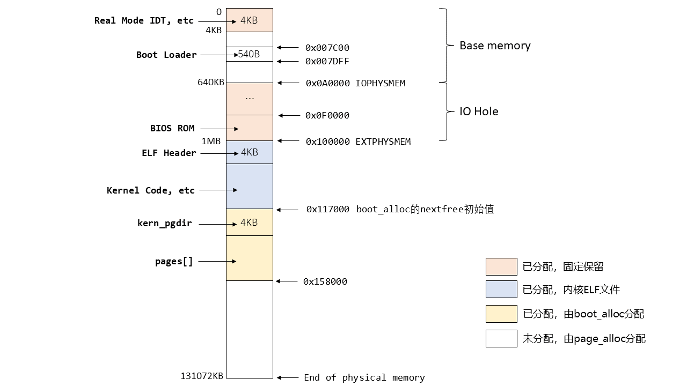
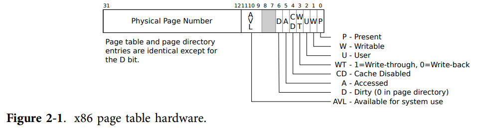

# MIT CS6.828-Lab 2: Memory Management

Lab 2 实现 JOS 的内存管理。内存管理分为两部分：

1. 物理内存管理
2. 虚拟内存管理

## Part 1: Physical Page Management

---

**练习 1. 在文件`kern/pmap.c`中，您必须实现以下函数的代码（可能按照给定的顺序）。**

```
boot_alloc()
mem_init()（只到调用check_page_free_list(1)）
page_init()
page_alloc()
page_free()
```

**`check_page_free_list()`和 `check_page_alloc()`会测试你的物理页面分配器。你应该启动 JOS 并查看是否`check_page_alloc()` 报告成功。修复你的代码，使其通过。你可能会发现添加自己的`assert()`s 有助于验证您的假设是否正确。**

---

和 Lab 1 的详尽引导不同，从 Lab 2 开始的实验多少有点“fly bitch"的感觉……

### 1. 物理内存布局及相关数据结构

练习 1 阶段的物理内存布局如下图所示：（图是我根据 Lab 1 和在练习 1 函数中打印的相关信息画的，欢迎纠错）



物理内存管理是以页而非字节为单位的，Lab 2 已规定了一页的大小：`PGSIZE 4096`，即一页为 4 KB。所谓内存管理，实际上就是要保存并时刻更新内存中各页的状态，哪些可用，哪些已用，有进程来申请使用应该如何分配……

**`PageInfo`：Lab 2 定义好的，用于保存一页信息的结构体：**

```c
struct PageInfo {
	// Next page on the free list.
	struct PageInfo *pp_link;

	// pp_ref is the count of pointers (usually in page table entries)
	// to this page, for pages allocated using page_alloc.
	// Pages allocated at boot time using pmap.c's
	// boot_alloc do not have valid reference count fields.

	uint16_t pp_ref;
};
```

- `pp_link`是一个内存地址，该地址存储一个`PageInfo`类型的变量；从功能上，它指向下一个空闲页所对应的`PageInfo`。

  可以通过以下方式遍历这个空闲页链表：

  ```c
  PageInfo* first_free_page, *free_page;
  free_page = first_free_page; 
  // first_free_page是已知的第一个空闲页的PageInfo的地址
  while(free_page){
      //do something;
  	free_page = free_page -> pp_link;
  }
  ```

- `pp_ref`是该页的指针计数器。仅在该页通过`page_alloc`分配时`pp_ref`有效，`pp_ref=0`时表示该页空闲；若该页是通过`boot_alloc`分配的，不需要管理`pp_ref`。具体细节在 Part 2 介绍。

**`pages`：Lab 2 定义好的，用于保存物理内存所有页对应`PageInfo`的数组：**

```c
struct PageInfo *pages;	
```

`pages`的每一个元素都能与相应的物理内存页面一一对应，如`pages[0]`对应物理内存的第一个 4KB，`pages[1]`对应物理内存的第二个 4KB……以此类推，所以可以通过下标直接计算得到它所对应的物理内存页面的起始地址。

`pages`中每一个元素的`pp_link`构成了一个空闲页链表，链表中的每一个结点都是空闲页对应的`PageInfo`，这些空闲页在物理上不一定相邻，如下图所示（仅为示意图，不代表实际内存分配情况，箭头方向是根据下文`page_init`函数的实现画的）：


显然，对于已分配的`PageInfo`，其`pp_link`应为`NULL`。

有了对整体内存布局及相关数据结构的把握，接下来可以着手完成练习 1了。

### 2. 物理内存管理

JOS 内存管理初始化是从`mem_init`完成的，它做了以下工作：

1. 调用`i386_detect_memory`读硬件状态，获取物理内存总大小及物理内存中基本内存部分的大小（单位 KB），同时换算为页数；
2. 调用`boot_alloc`，分配大小为`PGSIZE`的内存用于存储`kern_pgdir`，它是内核的页目录表。
3. 调用`boot_alloc`，划分出一块内存用于存储`pages`，即用于记录物理页状态的数组
4. 调用`page_init()`，初始化真正的内存管理机制。

`boot_alloc()`负责建立物理内存管理期间的内存分配工作：

```c
if(n == 0){
    return nextfree;
}
else if(n > 0){
    char* result = nextfree;
    nextfree = ROUNDUP((char*)(nextfree + n), PGSIZE);
    // 需要以页为单位分配，如申请了6KB也要分配8KB，因此使用ROUNDUP，向上取PGSIZE的倍数
    if(PADDR(nextfree) >= npages * PGSIZE)
        panic("boot_alloc: out of memory!\n");
    else return result; // 返回一个虚拟地址
}
else 
    panic("boot_alloc: the parameter n is invalid!\n");
	// 这个panic写不写无所谓，只是讲究一个鲁棒性
```

然后在`mem_init()`中调用`boot_alloc()`为`kern_pgdir`和`pages`分配内存：

```c
// create initial page directory.
	kern_pgdir = (pde_t *) boot_alloc(PGSIZE);
	memset(kern_pgdir, 0, PGSIZE);
```

```c
// 为物理页状态数组分配内存并初始化为0
	pages = boot_alloc(npages * sizeof(struct PageInfo));
	memset(pages, 0, npages * sizeof(struct PageInfo));
```

`page_init()`需要标记哪些内存是可用的，哪些内存是不可用的/已占用的。代码注释已直接指明，照着实现即可：

```c
//  1) Mark physical page 0 as in use.
	pages[0].pp_ref = 1;
```

```c
//  2) The rest of base memory, [PGSIZE, npages_basemem * PGSIZE) is free.
	size_t i;
	for(i = 1; i < npages_basemem; i++){
		pages[i].pp_ref = 0;
		pages[i].pp_link = page_free_list;
		page_free_list = &pages[i];
        // pages[1].pp_link = NULL;
        // pages[2].pp_link = &pages[1];
        // ...
        // pages[npages_basemem-1].pp_link = &pagepages[npages_basemem-2]
	}
```

```c
// 3) Then comes the IO hole [IOPHYSMEM, EXTPHYSMEM), which must never be allocated.
// 在inc/memlayout.h中:IOPHYSMEM 0x0A0000, EXTPHYSMEM 0x100000
	for(i = (IOPHYSMEM >> PGSHIFT); i < (EXTPHYSMEM >> PGSHIFT); i++){ 
	// PGSHIFT = 12，IOPHYSMEM>>PGSHIFT 等价于 IOPHYSMEM/4096，计算机做除法很慢，所以这里尽量用右移代替
		pages[i].pp_ref = 0;
        // 不允许被分配，通过pages[i].pp_link = NULL实现
	}
```

```c
// 4) Then extended memory [EXTPHYSMEM, ...).
/*    Some of it is in use, some is free. Where is the kernel in physical memory?  Which pages are already in use for page tables and other data structures? */
// 第0页已占用，0x0A0000 ~ 0x0FFFFF 为IO Hole已占用，0x100000 ~ 0x117000-0x1(0x116FFF) 为内核ELF文件区域已占用，上述部分已经标记完毕。
// 0x117000 ~ 0x158000-0x1已由boot_alloc分配，从0x158000开始后面全部空闲
	size_t EXT_first_free = PADDR(boot_alloc(0)) >> PGSHIFT;
	// boot_alloc(0)返回的是一个虚拟地址，通过PADDR转换为物理地址
	// EXT_first_free = 0x158000 >> 12
	for(i = (EXTPHYSMEM >> PGSHIFT); i < EXT_first_free; i++){
		pages[i].pp_ref = 1; // 已由boot_alloc分配的部分
	}
	// 余下部分均标记为空闲
	for(i = EXT_first_free; i < npages; i++){
		pages[i].pp_ref = 0;
		pages[i].pp_link = page_free_list;
		page_free_list = &pages[i];
	}
```

`page_alloc()`负责实现一页的内存分配：

```c
struct PageInfo *
page_alloc(int alloc_flags)
{
	// 只需要返回所分配的页的对应PageInfo虚拟地址，而不是实际分配内存的起始地址
	if(page_free_list == NULL) return NULL;
	// page_free_list此时已指向空闲页链表的表头结点，是一个虚拟地址
	struct PageInfo *ret = page_free_list;
	page_free_list = page_free_list->pp_link;
	if (alloc_flags & ALLOC_ZERO){
		memset(page2kva(ret),'\0', PGSIZE); 
		// page2kva：参数为PageInfo虚拟地址，返回该PageInfo对应的页的虚拟地址
		// 将该页中数值全部初始化为'\0'
	}
	// 记得将分配出去的页从空闲页链表中摘出去
	ret -> pp_link = NULL;
	// 不增加 pp_ref，该工作由调用者完成
	return ret; // 返回虚拟地址
}
```

`page_free()`负责实现一页的内存回收：

（注：如果此处加上`panic`会导致`check_page_alloc()`无法通过，说明`page_alloc`里漏了写`ret -> pp_link = NULL;`）

```c
void
page_free(struct PageInfo *pp)
{
	// Fill this function in
	// Hint: You may want to panic if pp->pp_ref is nonzero or
	// pp->pp_link is not NULL.
	if(pp->pp_ref != 0 || pp->pp_link != NULL) 
		panic("page_free error!");
	pp->pp_link = page_free_list; 
	page_free_list = pp;
	//从空闲页链表头部插入结点
}
```

至此练习 1 已完成，`make grade`应输出以下信息：

```
running JOS: (1.0s) 
  Physical page allocator: OK 
  Page management: FAIL 
    AssertionError: ...
         check_page_alloc() succeeded!
```

## Part 2: Virtual Memory

### 1. 页式、段式、段页式

虚拟内存管理的意义在于，它可以将计算机可使用的内存范围从物理内存扩展到物理内存+磁盘。某一时刻，一个虚拟内存地址对应的数据可能并不实际存储在物理内存中。当然，CPU能直接访问的只有物理内存，若遇到了上述情况，首先从磁盘中将相关的页调入物理内存，再进行访问。

虚拟内存管理方式有三种：页式管理、段式管理、段页式管理。

- 页式管理：与前文对物理内存的管理方式相同，就是以一个固定大小将内存划分为若干页进行管理。

- 段式管理：在[Lab1 Part2的3.2节](https://www.cnblogs.com/streamazure/p/17074080.html)已经简单介绍了如何由段内偏移量和段选择器得出完整的内存地址。与页式管理直接按固定大小分页不同，段式管理分段的依据是程序中各部分的功能，如代码段、数据段等。
- 段页式管理：对于一个程序，先分段，后分页。如代码段长度有 20KB，可划分为 5 页。地址转换也相应复杂了起来。

JOS 使用分页机制来实现虚拟内存和保护，但在 x86 上无法禁用段转换和基于段的保护，因此需要对段式管理有基本了解。

### 2. 虚拟地址、线性地址、物理地址

- 虚拟地址：由段选择器和段内偏移量构成的地址
- 线性地址：经过段式地址转换后得到的地址
- 物理地址：线性地址进一步经过页式地址转换后得到的地址，它明确地指向一个实际存在的物理内存单元。

在 JOS 中，切换为保护模式之后，无法直接用线性地址和物理地址访问数据，所有的地址都被视为虚拟地址。

JOS 内核经常需要对地址本身进行操作，为了区分，定义了以下两种类型，它们实际上都是32位整型：

- `uintptr_t`：虚拟地址
- `physaddr_t`：物理地址

```c
int x = 1;
int *p = &x;
uintptr_t addr = 0xf0112f4c; // 是p的值，复现本代码需根据实际情况修改
cprintf("*p = %d\np = %x\naddr = %x\n", *p, p, addr);
// *p = 1
// p = f0112f4c
// addr = f0112f4c
```

需要注意的是，`addr`只是一个普通的 32 位整数，并非`int*`类型，因此无法使用解引用（derefference）运算符`*addr`。但这个`addr`又确实是一个地址，要想访问这个地址对应的数据，可以将`addr`强制转换为`int*`类型后再解引用：

```c
cprintf("*addr = %d\n", *(int*)addr);
// *addr = 1
```

但对于`physaddr_t`类型，不能使用类型转换来解引用，实际访问的地址可能与预期不符。

总结：在 Lab 2 中，将会接触和使用的保存地址的类型如下表所示：

| C type                            | 保存的地址类型 |
| --------------------------------- | -------------- |
| T* (int*, char\*, double\*, etc.) | 虚拟地址       |
| uintptr_t                         | 虚拟地址       |
| physaddr_t                        | 物理地址       |

---

**Question**

1. **假设以下内核代码是正确的, `x`应该是什么类型？`uintptr_t`or`physaddr_t`?**

   ```c
   	mystery_t x;
   	char* value = return_a_pointer();
   	*value = 10;
   	x = (mystery_t) value;
   ```

   `x`应该是`uintptr_t`。`value`为`char*`，它保存了对应于`char`的一个虚拟地址，要保证正确，只能强制转换为同为保存虚拟地址的`uintptr_t`类型。

---

既然 C 代码中只能用虚拟地址，JOS 内核又如何访问那些只知道物理地址的内存？如`PageInfo* pages`的内存分配需要在物理内存上直接进行。

事实上，在 Lab1 Part3 就已经预先做好了这项工作：通过手写的、静态初始化的页目录和页表来完成对前 4MB 的物理地址到虚拟地址的转换，如物理地址`0` 映射为虚拟地址`0xf0000000`。

在代码中两者之间的相互转换可以用以下两个宏定义（练习 1 已经用过了）：

```c
vir_addr = KADDR(phy_addr)
phy_addr = PADDR(vir_addr)
```

### 3. 引用计数

`struct PageInfo`结构中定义了`pp_ref`用于引用计数。它用于同时将同一个物理页面映射到多个虚拟地址。

例如，有多个进程需要共用物理页面`phy_page`，在它们各自的地址空间里，`phy_page`所对应的虚拟地址都是不一样的。此时的`pp_ref`就是在记录有多少个进程在使用`phy_page`。若`pp_ref`为`0`，则该物理页所占用的内存可以回收。

严格来说，`pp_ref`应该等于该物理页在所有页表中`UTOP`以下出现的次数。（`UTOP`以上的页表项由内核在启动时设置，且永远不释放，所以没必要纳入计数）

`page_alloc`返回值的`pp_ref`应为 0。当调用者对页面进行了其他操作，如`page_insert`时，`pp_ref`才会递增。

### 4. 页表管理

这里要先知道页表是什么。以下为[xv6 - Charpter2.Page Table](https://pdos.csail.mit.edu/6.828/2018/xv6/book-rev11.pdf)的原文翻译，有部分修改以增强可读性：

x86 指令（包括内核态和用户态）使用虚拟地址。但计算机的RAM，或者说，物理内存，是用物理地址作为索引的。x86 页表硬件将每个虚拟地址（32 bit）一一映射为物理地址（32 bit）。

一个 x86 页表在逻辑上是一个包含 2^20 个页表项（page table entry, PTE）的数组。每个页表项包含一个 20 bit 长的物理页号（physical page number, PPN）以及一些标志位，如下图所示：



Paging hardware（我习惯的称呼是地址变换机构）会取出一个虚拟地址的前 20 bit 作为索引，在页表中找到对应的页表项，并用该页表项的物理页号代替这 20 bit，余下的 12 bit 原封不动，就得到了对应的物理地址。这也意味着，一页的大小为 2^12 字节。

实际上，页式地址变换一共有 2 步。所有的页表以一棵 2 层的树（二级页表）的形式组织起来存储在物理内存中。

- 树的根结点称为**页目录**，总大小为 4096 字节，包含 1024 个条目（page directory entry, PDE）。每个 PDE 对应一个页表，每个页表都是一个包含 1024 个页表项的数组，每个页表项 32 bit.
- Paging hardware 取出虚拟地址的前 10 bit 作为索引，在页目录中找到对应页表；再取接下来 10 bit 作为索引，在页表中找到对应页表项。如果找不到页表或者找不到页表项，Paging hardware 会报告出错。

为了动态更新和维护页表，还需要记录各页表项对应页的一些信息，因此每个页表项都有一些标志位。最基本地，需要知道页是否允许读、允许写等。常用标志位如：

- PTE_P：指示该页是否存在（于物理内存中）。若为`0`，则报告出错。
- PTE_W：是否允许写该页。若为`0`，则页是只读的。
- PTE_U：用户程序能否使用该页。若为`0`，只有内核程序可以使用。

---

**练习 4. 现在你将编写一组函数来管理页表：插入和删除线性地址到物理地址的映射，并在需要时创建页表页。在文件`kern/pmap.c`中，你必须实现以下函数的代码。**

```
pgdir_walk() 
boot_map_region() 
page_lookup() 
page_remove() 
page_insert()
```

**`check_page()`会测试你的页表管理函数。确保它报告成功后再进行后面的部分。**

---

`pgdir_walk`：线性地址→查页目录→查页表→找到对应页表项，返回页表项的虚拟地址。注意处理页表不存在的情况。

这里需要着重理解一下相关的类型及宏定义：

`pde_t* pde;`：声明了一个指针`pde`，它保存了一个`pde_t`类型的地址。使用时，`pde`是地址，`*pde`是该地址内存中保存的值，有32位长，是页目录项的内容。

- `PTE_ADDR(*pde)`：取出该页目录项内容中的物理地址部分，即一个页表的物理地址
- `*pde & PTE_P`：取出该页目录项内容中的`PTE_P`位，结果为`0`或`1`。

```c
pte_t *
pgdir_walk(pde_t *pgdir, const void *va, int create)
{ // 根据虚拟地址va找到对应页表项，返回页表项的虚拟地址
	
	pde_t* pde = &pgdir[PDX(va)];
    // PDX(va)取va的前10bit作为下标，找到对应PDE
	pte_t* pte;
	if(*pde & PTE_P){ // 若该PDE的PTE_P标志位为1，对应页表存在
		pte = KADDR(PTE_ADDR(*pde));
        // PTE_ADDR(*pde)取出该页表物理地址，并转为虚拟地址
		pte = &pte[PTX(va)];
        // 将pte视为数组的起始地址，&pte[PTX(va)]即对应页表项的地址
        // 上面两行等价于 pte = KADDR(PTE_ADDR(*pde)) + 4 * PTX(va);
		return pte; // 返回页表项虚拟地址
	}
	else if (create){
		// 如果连对应的页表都没有，新建并分配物理页
		struct PageInfo *pg = page_alloc(ALLOC_ZERO);
		if(pg){
			pg -> pp_ref ++;
			*pde = (page2pa(pg)) | PTE_P | PTE_U | PTE_W;
			// 在页目录项中填入内容：页表物理地址 + PTE_P标记页表存在
			pte = KADDR(PTE_ADDR(*pde));
			pte = &pte[PTX(va)];
			return pte; // 新的页表项虚拟地址
		}
	}
	return NULL;
}
```

注意：`PTX(va)`和`PDX(va)`都是`index`，而非`offset`，这是注释里明确指出的。假设页表起始虚拟地址为`pte_head`，则在该页表中查找`va`的页表项`pte`，应为`pte = pte_head[PTX(va)]`，而不能写成`pte = pte_head + PTX(va)`。因为页表中的每一项长度都为 4B，写成数组下标形式时会自然地以 4B 为单位，而写成偏移量形式时是以 1B 为单位。所以`pte = pte_head[PTX(va)]`其实等价于`pte = pte_head + 4 * PTX(va)`.（因为没有搞清楚`PTX(va)`到底是当下标用还是当偏移量用，我在这里浪费了非常多的时间Debug……）

`boot_map_region`：将虚拟地址 va~va+size 映射到物理地址 pa~pa+size。调用者保证 size 是 PGSIZE 的整数倍。遍历所有虚拟地址，调用pgdir_walk逐个生成对应页表项：

```c
static void
boot_map_region(pde_t *pgdir, uintptr_t va, size_t size, physaddr_t pa, int perm)
{
	pte_t *pte;
	int i;
	for(i = 0; i < size; i+=PGSIZE){ 
        // size是要映射的总字节数，涉及size/PGSIZE个页表项
		pte = pgdir_walk(pgdir, (void*)va, 1);
		*pte = pa | perm | PTE_P; // 填入对应物理地址及标志位
		va += PGSIZE;
		pa += PGSIZE;
        // 每建立一个页表项，完成PGSIZE个虚拟地址的映射
	}
}
```

`page_lookup`：返回虚拟地址`va`对应的物理页物理地址；必要时将页表项地址保存在`*pte_store`中返回给调用者：

```c
struct PageInfo *
page_lookup(pde_t *pgdir, void *va, pte_t **pte_store)
{
	struct PageInfo* ret = NULL; 
	pte_t* pte = pgdir_walk(pgdir, va, 0);
	if(pte && (*pte & PTE_P)){
		if(pte_store){
			*pte_store = pte;
		}
		ret =  pa2page(PTE_ADDR(*pte)); 
	}
	return ret;
}
```

`page_remove`：删除虚拟地址`va`对物理页地址的一个映射：

```c
void
page_remove(pde_t *pgdir, void *va)
{
	pte_t* pte = NULL;
	struct PageInfo* pgInfo = page_lookup(pgdir, va, &pte); 
    // 要求返回对应页表项地址，保存在pte中
	if(pgInfo != NULL && (*pte & PTE_P)){ 
        // 物理页面有可能不存在，如连续对同一个va调用两次page_remove
		page_decref(pgInfo); // 包含了 pgInfo->ref--;
		*pte = 0;
		tlb_invalidate(pgdir, va);
	}
}
```

`page_insert`：建立物理页`pp`到虚拟地址`va`的一个映射：

```c
int
page_insert(pde_t *pgdir, struct PageInfo *pp, void *va, int perm)
{
	// 建立物理页pp到虚拟地址va的映射
	// 如果已经有其他物理页映射到va，执行page_remove删除它
	// 如果已有pp到va的映射，同上，统一做法
	pte_t * pte = pgdir_walk(pgdir, va, 1);
	if(pte == NULL){
		return -E_NO_MEM; // 对应页表不存在且无法分配内存新建页表
	}
	pp -> pp_ref ++; //必须在page_remove前执行
	if((*pte) & PTE_P){
		page_remove(pgdir, va); 
		// 已有映射，删掉，TLB invalidate已包含在page_remove中
	}
	*pte = page2pa(pp) | perm | PTE_P; // 填写页表项
	return 0;
}
```

注意：`pp->pp_ref++`必须在`page_remove`之前。因为`page_remove`会调用`page_decref(pgInfo);`，后者会在执行`pp->pp_ref--`之后立即判断该物理页是否0映射，若为0映射则会立即将页`free`掉。如果`pp->pp_ref++`在后面执行，会引起错误。

最后运行出现`check_page() succeeded!`，练习 4 完成。

## Part 3: Kernel Address Space

### 1. 建立内核虚拟地址的映射

在 Part 3，我们需要建立虚拟地址空间中内核部分的映射。

---

**Exercise 5.** Fill in the missing code in `mem_init()` after the call to `check_page()`.

Your code should now pass the `check_kern_pgdir()` and `check_page_installed_pgdir()` checks.

---

分为三个部分：

1. 建立用户空间虚拟地址`UPAGES`到物理地址`pages`的映射，大小应为即`pages`的大小`npages * sizeof(struct PageInfo) `（0x40000），但在`inc/memlayout.h`的图中，R0 PAGES 所占地址空间大小为`PTSIZE`，所以应该设为`PTSIZE`。（但 0x40000 和 PTSIZE 都能通过测试）

2. 建立内核空间栈的虚拟地址`KSTACKTOP`到物理地址`bootstack`（在`entry.S`中定义的）的映射，注意地址是递减的。映射的地址空间大小（大于`KSTKSIZE`）被规定为`PTSIZE`，即一个页目录项可映射到的所有页面的总字节数（1024页*4KB）。

   但还需要特殊处理，将 [KSTACKTOP-PTSIZE, KSTACKTOP) 分为两部分进行映射，以`KSTACKTOP-KSTKSIZE`为界。其中 [KSTACKTOP-KSTKSIZE, KSTACKTOP) 部分映射到物理地址，而 [KSTACKTOP-PTSIZE, KSTACKTOP-KSTKSIZE) 不进行映射。

   这样做，可以确保栈向低地址增长时始终与其他数据保持着一定的空白区域，一旦栈溢出，也只会溢出到这片区域内，而不会覆盖掉其他数据。

3. 建立虚拟地址 [KERNBASE, 2^32) 到全部物理地址 [0, 2^32 - KERNBASE) 的映射，大小为 `0xffffffff - 0xf0000000`。当然，实际物理内存并没有这么大，但不管怎样就是这么设了……注释也没说为什么。

```c
// UPAGES
boot_map_region(kern_pgdir, UPAGES, PTSIZE, PADDR(pages), PTE_U);
// kernel stack
boot_map_region(kern_pgdir, KSTACKTOP-KSTKSIZE, KSTKSIZE, PADDR(bootstack), PTE_W);
// all of physical memory
boot_map_region(kern_pgdir, KERNBASE, 0xffffffff - KERNBASE, 0, PTE_W);
```

到这里`pmap.c`全部完成。

```
running JOS: (1.1s) 
  Physical page allocator: OK 
  Page management: OK 
  Kernel page directory: OK 
  Page management 2: OK 
Score: 70/70
```

现在来看一下建立上述映射后`kern_pgdir`的具体情况。在`mem_init`中加一点打印辅助：

```c
void
mem_init(void)
{
    ...
    check_kern_pgdir();
	...
    // 遍历kern_pgdir，打印每个PDE对应页表的第一项对应的虚拟地址
    int i;
    for(i = 0; i < 1024; i++){ // 共1024个页目录项
        if(!kern_pgdir[i]) continue;
        pte_t* first_pte = KADDR(PTE_ADDR(kern_pgdir[i]));
        physaddr_t pa = PTE_ADDR(*first_pte);
        // 使用页目录索引、页表索引、物理地址低12bit，拼接得到虚拟地址
        pte_t* va = PGADDR(i, 0, (pa & 0xfff));
        cprintf("kern_pgdir[%d]: 0x%x\n", i, va);
    }
}
```

输出结果：

```
kern_pgdir[956]: 0xef000000  # UPAGES，占一个页目录项
kern_pgdir[957]: 0xef400000  # UVPT
kern_pgdir[959]: 0xefc00000　# stack，占一个页目录项
kern_pgdir[960]: 0xf0000000  # KERNBASE
kern_pgdir[961]: 0xf0400000
...
kern_pgdir[1021]: 0xff400000
kern_pgdir[1022]: 0xff800000
kern_pgdir[1023]: 0xffc00000
```

### 2. 页的权限管理

参考：[Intel 80386 Reference Programmer's Manual Table of Contents 6.4 Page-Level Protection](https://pdos.csail.mit.edu/6.828/2018/readings/i386/s06_04.htm)

前面提过，页表项结构如下图所示：


其中：

- U位：1-用户级，0-特权级。用户态下仅能寻址用户级页面，内核态下能寻址所有页面。用户态/内核态是由 CPL （当前特权级）字段的值决定的，CPL保存在寄存器中。
- W位：1-可读可写，0-只读。用户态下只能写那些可读可写的用户级页面，且所有的特权级界面都不可读不可写。内核态下可以读写所有页面。

这两位结合可以实现对页的各类权限设置。

### 3. Questions

---

**Question**

1. **What entries (rows) in the page directory have been filled in at this point? What addresses do they map and where do they point? In other words, fill out this table as much as possible:**

   对照前面的打印信息及`memlayout.h`中的虚拟地址布局填写。

   | Entry | Base Virtual Address | Points to (logically):                 |
   | ----- | -------------------- | -------------------------------------- |
   | 1023  | 0xffc00000           | Page table for top 4MB of phys memory  |
   | ...   | ...                  | ...                                    |
   | 961   | 0xf0400000           | Page table for [4,8) MB of phys memory |
   | 960   | 0xf0000000           | Page table for [0,4) MB of phys memory |
   | 959   | 0xefc00000           | 内核栈空间（含无映射部分）             |
   | ...   | ...                  | ...                                    |
   | 957   | 0xef400000           | UVPT                                   |
   | 956   | 0xef000000           | UPAGES                                 |
   | ...   | ...                  | ...                                    |

2. **我们已经将内核和用户环境放在同一个地址空间中。为什么用户程序无法读取或写入内核内存？哪些具体机制保护内核内存？**

   内核内存相关页面的页表项的U位置0，设为特权级页面，拒绝用户态下对这些页面的寻址，因此用户程序无法读取或写入内核内存。

   机制已在前文说明。

3. **该操作系统可以支持的最大物理内存量是多少？为什么？**

   2GB。`UPAGE`空间为 4MB，即数组`pages`最多可以有 4MB/8B = 512K 个元素，每个物理页面 4KB，则 512K 个物理页面总大小为 512*1024\*4\*1024 B = 2 GB。

4. **How much space overhead is there for managing memory, if we actually had the maximum amount of physical memory? How is this overhead broken down?**

   达到最大物理内存时，`pages`需要 4MB，512K 个物理页面对应 512K 个页表项，每个页表项 4B，需要 2MB 存储全部页表项。另页目录表`kern_pgdir`占4KB（实际上貌似2KB就够用了）。故内存管理开销为 6MB + 4KB.

5. **重新查看`kern/entry.S`和 `kern/entrypgdir.c`中的页表设置。在我们开启分页后，EIP 仍然是一个较低的数字（略高于 1MB）。我们在什么时候切换到在 KERNBASE 之上的 EIP 上运行？从启用分页到开始使用高于 KERNBASE 的 EIP 这一段时间内，为什么我们能够继续使用低 EIP ？为什么这种切换是必要的？**

   在`kern/entry.S`的`jmp *%eax`处切换。`entrypgdir.c`硬编码了一个静态页表，建立了虚拟地址 [0, 4M) 到物理地址 [0, 4M) 的映射，因此在切换之前低 EIP 可用。必须进行切换，因为内核倾向于运行在很高的地址空间，以保证内核的虚拟地址空间有足够的冗余来同时映射到它下面的用户环境中（？不是很确定）

### 4. 挑战：扩展 JOS monitor

Lab 2 留了几道挑战题，我菜，挑个最简单的……

---

*Challenge!* Extend the JOS kernel monitor with commands to:

- Display in a useful and easy-to-read format all of the physical page mappings (or lack thereof) that apply to a particular range of virtual/linear addresses in the currently active address space. For example, you might enter `showmappings 0x3000 0x5000`to display the physical page mappings and corresponding permission bits that apply to the pages at virtual addresses 0x3000, 0x4000, and 0x5000.
- Explicitly set, clear, or change the permissions of any mapping in the current address space.
- Dump the contents of a range of memory given either a virtual or physical address range. Be sure the dump code behaves correctly when the range extends across page boundaries!
- Do anything else that you think might be useful later for debugging the kernel. (There's a good chance it will be!)

---

```c
int 
mon_showmappings(int argc, char **argv, struct Trapframe *tf)
{
	if(argc == 1 || argc > 3) {
		cprintf("Usage: showmappings <begin_addr> <end_addr>\n");
		return 0;
	}
	uint32_t begin_addr = xtoi(argv[1]);
	uint32_t end_addr = xtoi(argv[2]);
	// cprintf("begin: %x, end: %x\n", begin_addr, end_addr);
	int i;
	for(i = begin_addr; i <= end_addr; i+=PGSIZE){
		pte_t* pte = pgdir_walk(kern_pgdir, (void *)i, 0);
		if(!pte || !(*pte & PTE_P)) {
			cprintf("missing physical page\n");
			continue;
		}
		else {
			cprintf("page %x ", KADDR(PTE_ADDR(*pte)));
			cprintf("PTE_P: %d, PTE_W: %d, PTE_U: %d", *pte & PTE_P, (*pte & PTE_W) >> 1, (*pte & PTE_U) >> 2);
			cprintf("\n");
		}
	}
	return 0;
}
```

```c
int 
mon_change_mappings_permission(int argc, char** argv, struct Trapframe *tf)
{
	if(argc == 1 || argc > 4) {
		cprintf("Usage: chmapper <addr> <set|clear> <PTE_W|PTE_U>\n");
		return 0;
	}
	uint32_t addr = xtoi(argv[1]);
	pte_t* pte = pgdir_walk(kern_pgdir, (void *)addr, 0);
	if(!pte || !(*pte & PTE_P)){
		cprintf("missing phiscal page\n");
		return 0;
	}
	if(strcmp(argv[3], "PTE_W") == 0){
		if(strcmp(argv[2], "set") == 0){
			*pte |= PTE_W;
		}
		else if(strcmp(argv[2], "clear") == 0){
			*pte = *pte & (~PTE_W);
		}
	}
	else if(strcmp(argv[3], "PTE_U") == 0){
		if(strcmp(argv[2], "set") == 0){
			*pte |= PTE_U;
		}
		else if(strcmp(argv[2], "clear") == 0){
			*pte = *pte & (~PTE_U);
		}
	}
	else{
		cprintf("Usage: chmapper <addr> <set|clear> <PTE_W|PTE_U>\n");
		return 0;
	}
	return 0;
}
```

```
K> showmappings ef000000 ef005000
page f011c000 PTE_P: 1, PTE_W: 0, PTE_U: 1
page f011d000 PTE_P: 1, PTE_W: 0, PTE_U: 1
page f011e000 PTE_P: 1, PTE_W: 0, PTE_U: 1
page f011f000 PTE_P: 1, PTE_W: 0, PTE_U: 1
page f0120000 PTE_P: 1, PTE_W: 0, PTE_U: 1
page f0121000 PTE_P: 1, PTE_W: 0, PTE_U: 1
K> chmapper ef000000 set PTE_W
K> showmappings  ef000000  ef000000
page f011c000 PTE_P: 1, PTE_W: 1, PTE_U: 1
K> chmapper ef000000 clear PTE_W
K> showmappings  ef000000  ef000000
page f011c000 PTE_P: 1, PTE_W: 0, PTE_U: 1
```

# 参考资料

1. [xv6 - Chapter 2 Page tables](https://pdos.csail.mit.edu/6.828/2018/xv6/book-rev11.pdf)
2. https://github.com/Clann24/jos/tree/master/lab2