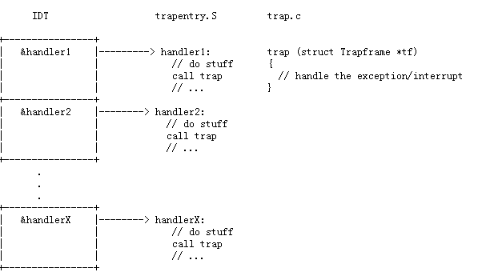

# MIT 6.828-Lab3: User Environments

本次 Lab 中的 environment 一词可以与 process 互换，也就是说本次 Lab 的目标是**实现进程**，即运行程序的抽象。但文档中都使用“环境”一词，意在强调 JOS 的“环境”与 Unix 的“进程”在接口和语义上均有差异。

## Part A: User Environments and Exception Handling

### 1. 用户环境的管理、创建与运行

如果学过操作系统原理，就会知道操作系统通过数据结构 PCB 来记录进程信息。在 JOS 中同样需要一个数据结构来记录用户环境信息。该数据结构`env`已声明在文件`inc/env.h`中，定义位于文件`kern/env.c`。

首先，操作系统需要管理多个环境，在`kern/env.c`中：

```c
struct Env *envs = NULL;		// All environments
struct Env *curenv = NULL;		// The current env
static struct Env *env_free_list;	// Free environment list
					// (linked by Env->env_link)
```
- `envs`：是一个数组的指针。JOS 用一个数组来保存所有激活的用户环境的`Env`结构。这个数组的最大大小由`NENV`限制，`NENV`为一个常量，定义在`inc/env.h`中。也就是说，同一时刻，系统最多支持`NENV`个用户环境存在。
- `curenv`：用于追踪当前正在运行的环境。
- `env_free_list`：为一个`Env`链表，保存未被激活的环境。可以通过该链表的增删来进行环境的管理（如创建、结束回收等）。

然后，来了解`Env`中都有哪些字段：

```c
struct Env {
	struct Trapframe env_tf;
    // 当环境被切换/中断时，该环境所使用的重要寄存器中的值，将被保存在env_tf中
    // 即用于保存所谓进程上下文的变量
	struct Env *env_link;
    // 指向env_free_list中的下一个空闲Env
	envid_t env_id;
    // 环境的唯一标识符，32位整型，有三个部分：状态标志位、唯一标志字段、Env下标
    // 系统中先后激活的两个环境可能使用相同的Env下标，但会拥有不同的唯一标志字段
	envid_t env_parent_id;
    // 父环境的Id，记录本环境由谁创建
	enum EnvType env_type; 
    // 环境类型，值通常是 ENV_TYPE_USER
    // 后续Lab会出现更多环境类型
	unsigned env_status;		
    // 值：ENV_FREE、ENV_DYING、ENV_RUNNABLE、ENV_RUNNING、ENV_NOT_RUNNABLE
    // 未激活、结束态、就绪态、运行态、不可运行（如阻塞）
	uint32_t env_runs;
	// 运行次数
	pde_t *env_pgdir;
    // 页目录指针，该页目录管理当前环境使用的所有页表。
};
```

JOS 中，同一时间*在内核中*只能有一个环境处于活动状态，因此 JOS 只需要一个内核栈。

在创建一个用户环境之前，先来初始化系统中用于管理用户环境的数组`envs`。

---

**练习 1：修改`kern/pmap.c`中的`mem_init()`函数，实现`envs`数组的分配和映射。注意，`envs`数组所代表的内存空间需要被映射到只读数组`UENVS`中（`inc/memlayout.h`定义），以便用户进程读取。完成后运行代码，确保`check_kern_pgdir()`通过。**

---

在 Lab2 中，我们完成的`mem_init()`函数的执行流程为：`i386_detect_memory`→`boot_alloc`→`page_init`。

现在需要在`page_init`之前初始化`envs`数组，通过`boot_alloc`分配大小为`NENV * sizeof(struct Env)`的内存空间给它即可。

```c
void
mem_init(void)
{
    ...
    //////////////////////////////////////////////////////////////////////
    // Make 'envs' point to an array of size 'NENV' of 'struct Env'.
    // LAB 3: Your code here.
    envs = boot_alloc(NENV * sizeof(struct Env));
    ...
}
```

虽然较 Lab2 多分配了一段内存空间，但后面的`page_init`无需改动，因为它是从`boot_alloc(0)`（直接返回`boot_alloc`分配空间之后的第一个空闲内存地址）开始进行页面初始化的。

分配空间之后，还要仿照`pages`到`UPAGES`的映射操作，建立`envs`到`UENVS`的映射：

```c
//////////////////////////////////////////////////////////////////////
// Map the 'envs' array read-only by the user at linear address UENVS
// (ie. perm = PTE_U | PTE_P).
// Permissions:
//    - the new image at UENVS  -- kernel R, user R
//    - envs itself -- kernel RW, user NONE
// LAB 3: Your code here.
boot_map_region(kern_pgdir, UENVS, PTSIZE, PADDR(envs), PTE_U);
```

最后`make qemu-nox`运行 JOS，显示以下信息，表示练习1完成。

```text
...
check_page_free_list() succeeded!
check_page_alloc() succeeded!
check_page() succeeded!
check_kern_pgdir() succeeded!
check_page_free_list() succeeded!
check_page_installed_pgdir() succeeded!
kernel panic at kern/env.c:461: env_run not yet implemented
Welcome to the JOS kernel monitor!
...
```

显然环境的初始化是系统初始化的一部分。回顾 Lab 1，使用汇编代码进行了部分初始化工作，并准备好 C 的运行环境之后，CPU 控制权转交给了 `kern/init.c`中的`i386_init()`函数。在`mem_init()`初始化内存之后，Lab 3 在其后新增了环境初始化`env_init()`和自陷功能的初始化`trap_init()`。

---

**练习 2：完成`kern/env.c`文件中的以下函数：**

- **env_init(): 初始化`envs`数组中的所有`Env`结构体，并把它们加入到`env_free_list`中。该函数还会调用`env_init_percpu`，这个函数负责初始化段式内存管理机制，并让它所管理的段具有两种优先级设置：内核运行时的0优先级、用户运行时的3优先级。**
- **env_setup_vm(): 为一个新的用户环境分配一个页目录表，并且初始化这个用户环境的地址空间中和内核相关的部分。**
- **region_alloc(): 为用户环境分配物理地址空间。**
- **load_icode(): 类似于 boot loader 的功能，负责解析一个 ELF 镜像，并将它的内容加载到用户环境。**
- **env_create(): 通过`env_alloc`函数分配一个用户环境，并调用`load_icode`函数，加载一个 ELF 镜像到用户环境**
- **env_run(): 在用户模式下，开始运行一个用户环境。**

**提示：使用`%e`来打印错误代码的详细描述，示例：**

```c
r = -E_NO_MEM;
panic("env_alloc: %e",r);
```

---

先从整个 JOS 初始化流程的角度理解一下我们正在哪里工作：

- start( kern/entry.S)
- i386_init( kern/init.c)
  - cons_init
  - mem_init（在 Lab2 已完成）
  - **env_init**
  - trap_init（在下一个练习完成）
  - **env_create**
  - **env_run**
    - env_pop_tf

对于`env_init()`，参考注释可知需要完成以下内容：

1. 将`envs`中的所有`Env`标记为 free， `env_id`设为 0
2. `Env`需要严格按照在`envs`的顺序插入到`env_free_list`中。这样，第一次调用`env_alloc()`时返回的会是`envs[0]`。

```c
void
env_init(void)
{
	// Set up envs array
	// LAB 3: Your code here.
	for(int i = 0; i < NENV; i++){
		envs[i].env_status = ENV_FREE;
		envs[i].env_id = 0;
		if(i == NENV - 1){
			envs[i].env_link = NULL;
		}
		else envs[i].env_link = &envs[i+1];
	}
	env_free_list = &envs[0];

	// Per-CPU part of the initialization
	env_init_percpu();
}
```

对于`env_setup_vm()`，它为用户环境`e`分配页目录表并设置表中与内核相关的页目录项，因为这部分页目录项对于所有用户环境来说都是相同的，都是共用内核页目录表中的对应项。

```c
static int
env_setup_vm(struct Env *e)
{
	int i;
	struct PageInfo *p = NULL;

	// 为页目录表申请空间
	if (!(p = page_alloc(ALLOC_ZERO)))
		return -E_NO_MEM;
    // LAB 3: Your code here.
	e->env_pgdir = (pde_t*)page2kva(p); // 页目录的虚拟地址，设为环境e的env_pgidr
	p->pp_ref++;
	for(i = 0;i < PDX(UTOP); i++){ //遍历位于UTOP下方的页目录项
		e->env_pgdir[i] = 0; //全部初始化为0
 	}
	for(i = PDX(UTOP); i < NPDENTRIES; i++){
		e->env_pgdir[i] = kern_pgdir[i]; 
        //UTOP以上的部分全部共用内核页目录表的页目录项
	}
	// UVPT maps the env's own page table read-only.
	// Permissions: kernel R, user R
	e->env_pgdir[PDX(UVPT)] = PADDR(e->env_pgdir) | PTE_P | PTE_U;
	return 0;
}
```

`region_alloc`需要根据传入的起始虚拟地址`va`和申请空间大小`len`，分配相应大小的物理内存，并通过新建和填写页表项（`kern/pmap.c`中的`page_insert`的功能）来建立虚拟地址和物理内存之间的映射。

注意，内存分配是以页为单位的，而`va`和`len`不一定以页为单位对齐。因此最好的做法是起始地址向下取整而结束地址向上取整，保证实际分配的内存大小不小于`len`。

```c
static void
region_alloc(struct Env *e, void *va, size_t len)
{
	void* start = (void*) ROUNDDOWN((uint32_t)va, PGSIZE); // 以页为单位，起始地址向下取整
	void* end = (void*) ROUNDUP((uint32_t)va + len, PGSIZE); // 结束地址向上取整
	// 即实际分配的物理内存不小于len
	struct PageInfo *p = NULL;
	void* i;
	for(i = start; i < end; i+=PGSIZE){
		p = page_alloc(ALLOC_ZERO); //申请内存
		if(!p) panic("region_alloc failed: allocation failed!\n");
		//填写页表项，建立映射
		if(page_insert(e->env_pgdir, p, i, PTE_W | PTE_U))
			panic("region_alloc failed: page_insert failed!\n");
	}
}
```

在为用户环境准备好内存空间之后，可以通过`load_icode`加载用户程序了。这里，我们载入的是一个 ELF 镜像文件，过程类似于`boot/main.c`中将 JOS 的 ELF 文件载入内存。

```c
static void
load_icode(struct Env *e, uint8_t *binary)
{
	struct Proghdr *ph, *eph;
	struct Elf* ELFHeader = (struct Elf*)binary;
	if (ELFHeader->e_magic != ELF_MAGIC)
		panic("load_icode error: invalid ELF image.\n");

	// 用户程序应该被加载到用户空间，用户空间由用户环境页目录 e->env_pgdir 管理
	// 但从加载内核到目前为止，所使用的页目录还是 kern_pgdir
	// 因此需要通过 lcr3(PADDR(e->env_pgdir)) 切换页目录（在 env_free 函数中有参考）
	lcr3(PADDR(e->env_pgdir));

	// 加载 ELF 中的各段
	ph = (struct Proghdr *) ((uint8_t *) ELFHeader + ELFHeader->e_phoff);
	eph = ph + ELFHeader->e_phnum;
	for (; ph < eph; ph++){
		if(ph->p_type == ELF_PROG_LOAD){ // 只需要加载有该标志的段
			region_alloc(e, ph->p_va, ph->p_memsz);
			memset((void*)ph->p_va, 0, ph->p_memsz); // 将申请到的用户空间先全部初始化为0
			memcpy((void*)ph, (void*)ph->p_va, ph->p_filesz); // 拷贝段内容（实际大小为ph->p_filesze）到用户空间
		}
	}
	// 为程序的栈分配空间，大小为一页，地址范围为 USTACKTOP - PGSIZE 到 USTACKTOP
	region_alloc(e, (void*)(USTACKTOP - PGSIZE), PGSIZE);

	// 将入口信息给到用户环境
	e->env_tf.tf_eip = ELFHeader->e_entry;

	// 最后将页目录切换回去
	lcr3(PADDR(kern_pgdir));
}
```

最后在`env_create`中调用上述子函数，创建新的用户环境：

```c
void
env_create(uint8_t *binary, enum EnvType type)
{
	// LAB 3: Your code here.
	struct Env *e;
	env_alloc(&e, 0);
	load_icode(e, binary);
	e->env_type = type;
}
```

`env_run`用户环境执行程序：

```c
void
env_run(struct Env *e)
{
    if(curenv){
		if(curenv->env_status == ENV_RUNNING)
			curenv->env_status = ENV_RUNNABLE;
	}
	curenv = e;
	curenv->env_status = ENV_RUNNING;
	curenv->env_runs++;
	lcr3(PADDR(curenv->env_pgdir));
    cprintf("env_run success!!!\n"); // 能运行到这里说明前面的函数基本正确
	env_pop_tf(&curenv->env_tf); // 加载用户环境上下文
}
```

完成上述函数后，`make qemu`运行内核。若能打印`env_run success!!!`，则前面的函数基本正确。这是一个简单的调试方法，如果存在错误，可以通过打印信息来进一步定位。

系统在完成系列初始化之后，进入用户空间并执行`hello`二进制文件，`hello`程序会执行一个系统调用`int`。此时需要发生用户态到内核态的切换，但目前 JOS 还没有完成这个，CPU 无法处理，会产生一个通用异常。而后因为同样的原因，CPU 也无法处理这个异常，再产生一个`double fault`异常，发现仍然无法处理，产生`Triple fault`之后，CPU 重置，系统重启（在通常的 QEMU 上如此。如果使用课程配套的补丁版 QEMU 则会停止并提示 Triple fault ）。

在`hello`程序中`sys_cputs`函数中的`int $0x30`设置断点（地址参考`obj/user/hello.asm`），来检查前面所执行的一切是否正确：

```bash
(gdb) b *0x800b52
Breakpoint 1 at 0x800b52
(gdb) c
Continuing.
The target architecture is set to "i386".
=> 0x800b52:    int    $0x30

Breakpoint 1, 0x00800b52 in ?? ()
```

能正常运行至 0x800b52， 练习 2 完成。

### 2. 中断和异常

---

**练习 3 ：阅读 [80386 程序员手册](https://pdos.csail.mit.edu/6.828/2018/readings/i386/toc.htm) 中的 [第 9 章异常和中断](https://pdos.csail.mit.edu/6.828/2018/readings/i386/c09.htm)**

---

中断和异常的基本概念及其区别在操作系统原理上学过，此处不再赘述，只关注它在 80386 及 JOS 上是如何实现的。

中断和异常的共同点是，当它们发生时，系统要进行用户态到内核态的切换，即中止当前正在执行的程序，保存好上下文，让 CPU 转而执行对应的内核程序进行中断/异常处理，处理完毕之后再恢复程序上下文，从中止的地方继续执行原先的程序。

<u>Q：怎么知道要执行哪些“内核程序”？“内核程序”又是哪里来的？保存在哪里？</u>

产生中断/异常的原因会因不同的设备、错误条件或请求类别而有所不同，但总的来说它们的种类是有限的且可确定的，并为它们编号，也就是**中断向量**（x86 支持最多 256 种中断/异常，因此中断向量是介于0到255之间的数字）。

也因此，可以为不同中断/异常预先编制好对应的内核程序进行处理，并将这些程序的入口地址（寄存器 eip 和 cs 的值）与中断向量一一对应，这就是**中断描述符表（Interrupte Descriptor Table, IDT）**。中断描述符表由内核设置，驻留在物理内存中，其内存地址由专用寄存器 IDTR 负责保存。

在 80386 中（[参考资料](https://pdos.csail.mit.edu/6.828/2018/readings/i386/s09_05.htm)），IDT 包含三种类型的中断描述符：任务门、中断门、陷阱门。格式如下图所示：


JOS 中，部分中断/异常类型及其对应的向量在`inc/trap.h`中定义：

```c
// Trap numbers
// These are processor defined:
#define T_DIVIDE     0		// divide error
#define T_DEBUG      1		// debug exception
#define T_NMI        2		// non-maskable interrupt
#define T_BRKPT      3		// breakpoint
#define T_OFLOW      4		// overflow
#define T_BOUND      5		// bounds check
#define T_ILLOP      6		// illegal opcode
#define T_DEVICE     7		// device not available
#define T_DBLFLT     8		// double fault
……
```

中断描述符表 IDT 则定义在`kern/trap.c`中：

```c
/* Interrupt descriptor table.  (Must be built at run time because
 * shifted function addresses can't be represented in relocation records.)
 */
struct Gatedesc idt[256] = { { 0 } };
```

<u>Q：如何保存程序上下文？又是如何恢复的？</u>

出于内核安全考虑（This save area for the old processor state must in turn be protected from unprivileged user-mode code; otherwise buggy or malicious user code could compromise the kernel.），程序上下文需要保存在内核空间的一个栈上。

为了指明这个栈的位置，需要数据结构 TTS（Task State Segment），它保存了这个栈的段选择子`ts_ss0`和栈指针`ts_esp0`。事实上 TTS 包含的内容远不止这两个，具体字段可查看在`inc/mmu.h`的`Taskstate`结构体声明。但在 JOS 中，只有上述两个字段被使用。

当需要保存程序上下文时，处理器首先从 TSS 中读取`ts_ss0`和`ts_esp0`，并据此切换到新栈；接着往新栈压入程序上下文（具体为寄存器 SS、ESP、EFLAGS、CS、EIP 的值，以及 err code（如果有））；然后，处理器访问 IDT，取出对应中断处理程序的 cs、eip 值，跳转至该程序。

<u>Q：如果中断处理程序执行时又发生中断（嵌套中断），还需要切换栈吗？</u>

只有当中断发生导致从用户态切换到内核态时，才需要切换栈。如果发生了嵌套中断，则第二次中断发生时处理器已经位于内核态，则需要保存的程序上下文会被继续压栈。这样，当处理器处理完第二次中断时，只需要简单地弹出栈中数据就可以回到第一次中断的处理程序继续执行。

然而，如果栈空间不足，不能继续将数据压栈，则处理器无法回到原来状态，会自动重启。


现在，我们需要实现 JOS 中向量号 0 到 31 （内部异常）的异常捕获。在这部分我们暂时不具体定义异常处理函数，所以仅仅是捕获而非处理.



`kern/trap.c`的`trap_init()`函数负责初始化 IDT。每一个中断/异常的对应处理函数定义在`trapentry.S`中。对于每一个处理函数，需要先在栈上构建一个 Trapframe 结构体（即保存原程序的上下文信息，声明在`inc/trap.h`中），然后以该 Trapframe 的地址为参数，调用`kern/trap.c`中的`trap()`函数。`trap()`会负责具体处理中断/异常。

### 3. 实现异常捕获

---

**练习 4：编辑 `kern/trapentry.S` 和 `kern/trap.c` 文件，并且实现上面所说的功能 。具体地，你需要完成：**

1. **在`trapentry.S`文件中为 `inc/trap.h`文件中的每一个 trap 添加对应处理函数。可参考宏定义 `TRAPHANDLER` 、`TRAPHANDLER_NOEC`**

2. **实现`TRAPHANDLER`所引用的`_alltraps`，具体要求为：**

   - **把值压入堆栈，使栈中元素看起来像一个 Trapframe 结构体** 
     - **将 GD_KD 的值加载到 %ds 和 %es 寄存器中**
     - **通过`pushl %esp`来向`trap()`函数传递一个指向 Trapframe 的指针作为参数。**
     - **`call trap`（`trap`能返回吗？）**

   **考虑使用`pushal`指令。**

3. **修改`trap_init()`函数来初始化 IDT，使表中每一项指向定义在`trapentry.S`中的入口指针。可参考宏定义`SETGATE`。**

**完成之后，执行`make grade`，应通过`divzero`，`softint`，`badsegment`三个测试。对应的测试程序可在`usr`目录下找到。**

---

先来读一下`trapentry.S`的代码：

```c
// TRAPHANDLER(name, num) ，name为处理函数名，num向量号
// 将向量号num压栈并跳转至_alltraps
// 适用于CPU会自动将error code压栈的traps
#define TRAPHANDLER(name, num)						\
	.globl name;		/* define global symbol for 'name' */	\
	.type name, @function;	/* symbol type is function */		\
	.align 2;		/* align function definition */		\
	name:			/* function starts here */		\
	pushl $(num);							\
	jmp _alltraps

// 功能同上，但适用于没有error code的traps
// 作为替代，会将0压栈，以保证trap frame在各种情况下格式统一
#define TRAPHANDLER_NOEC(name, num)					\
	.globl name;							\
	.type name, @function;						\
	.align 2;							\
	name:								\
	pushl $0;							\
	pushl $(num);							\
	jmp _alltraps

.text
```

关于哪些 traps 会压栈 error code 而哪些不会，在实验里好像没有提示……但可以直接从 [wiki](https://wiki.osdev.org/Exceptions) 搜到。这里的工作其实是通过上述两个宏将处理函数名和向量号一一绑定起来。处理函数需要后面自己定义，所以这里自己起一堆函数名就好。

```asm
/*
 * Lab 3: Your code here for generating entry points for the different traps.
 */
/* t_divide 是自己起的函数名，下同 */
TRAPHANDLER_NOEC(t_divide, T_DIVIDE)
TRAPHANDLER_NOEC(t_debug, T_DEBUG)
TRAPHANDLER_NOEC(t_nmi, T_NMI)
TRAPHANDLER_NOEC(t_brkpt, T_BRKPT)
TRAPHANDLER_NOEC(t_oflow, T_OFLOW)
TRAPHANDLER_NOEC(t_bound, T_BOUND)
TRAPHANDLER_NOEC(t_illop, T_ILLOP)
TRAPHANDLER_NOEC(t_device, T_DEVICE)
TRAPHANDLER(t_dblflt, T_DBLFLT)
TRAPHANDLER(t_tss, T_TSS)
TRAPHANDLER(t_segnp, T_SEGNP)
TRAPHANDLER(t_stack, T_STACK)
TRAPHANDLER(t_gpflt, T_GPFLT)
TRAPHANDLER(t_pgflt, T_PGFLT)
TRAPHANDLER_NOEC(t_fperr, T_FPERR)
TRAPHANDLER(t_align, T_ALIGN)
TRAPHANDLER_NOEC(t_mchk, T_MCHK)
TRAPHANDLER_NOEC(t_simderr, T_SIMDERR)
```

然后实现`_alltraps`。题目的意思是得按结构体`Trapframe`中字段的顺序来入栈，因为函数的最后会调用`trap()`，其参数就是`Trapframe`的指针。这里实际上是手动完成了C语言中函数调用时自动进行的参数入栈。

先来看`inc/trap.h`中`Trapframe`的声明：

```c
struct PushRegs {
	/* registers as pushed by pusha */
	uint32_t reg_edi;
	uint32_t reg_esi;
	uint32_t reg_ebp;
	uint32_t reg_oesp;		/* Useless */
	uint32_t reg_ebx;
	uint32_t reg_edx;
	uint32_t reg_ecx;
	uint32_t reg_eax;
} __attribute__((packed));

struct Trapframe {
	struct PushRegs tf_regs;
	uint16_t tf_es;
	uint16_t tf_padding1;
	uint16_t tf_ds;
	uint16_t tf_padding2;
	uint32_t tf_trapno;
	/* below here defined by x86 hardware */
	uint32_t tf_err;
	uintptr_t tf_eip;
	uint16_t tf_cs;
	uint16_t tf_padding3;
	uint32_t tf_eflags;
	/* below here only when crossing rings, such as from user to kernel */
	uintptr_t tf_esp;
	uint16_t tf_ss;
	uint16_t tf_padding4;
} __attribute__((packed));
```

具体是什么顺序，可以注意到在跳转到`_alltraps`之前，前文的两个宏定义已经依次将 error code 和向量号入栈，对应的就是`Trapframe`中的`tf_err`和`tf_trapno`，由此可以推测入栈顺序就是结构体字段从下往上的顺序。

理论上而言我们需要将程序上下文入栈，但具体是哪些寄存器呢？

由于`_alltraps`接下来的操作会修改 ds 和 es 寄存器，因此这两个是必须入栈的；

题目中提示使用`pushal`指令，这是将 8 个通用寄存器全部入栈的指令，也用上。

网上的答案都只将上述寄存器入栈，至于为什么能确定余下的其他寄存器不需要入栈，这里也没搞清楚（可能是因为我没学清楚寄存器……）。

解决了上述问题之后，`_alltraps`的余下部分直接照着题目写就好：

- GD_KD的定义可在`inc/memlayout.h`找到：`#define GD_KD 0x10 // kernel data`，这个其实是段选择子，载入寄存器实际上是让CPU转向执行内核代码。

```asm
/*
 * Lab 3: Your code here for _alltraps
 */
_alltraps:
    # pushl中的l后缀表示操作数大小为4字节，也就是Lab 1中栈元素的大小
    # 结构体声明中从下往上先是reg_edx，后是reg_esi，所以入栈顺序也是先ds再es
    pushl %ds
    pushl %es
    pushal
    
	# 将GD_KD载入ds、es寄存器
	movl $GD_KD, %eax
	movw %ax, %ds
	movw %ax, %es
	
	# 这里入栈的其实就是trap()所需要的参数：struct Trapframe *tf
	pushl %esp
	call trap
```

最后是`trap_init()`。需要向 IDT 表为上述每一个异常设置对应描述符。先看一下题目提示的`SETGATE`宏（在`inc/mmu.h`中）：

```c
#define SETGATE(gate, istrap, sel, off, dpl)
/*
 * 由注释可知：
 * SETGATE宏用于设置中断门/陷阱门描述符
 * gate参数没有说明，实际上要传入的是描述符本身，如idt[T_DIVIDE]
 * istrap: 1表示陷阱门，0表示中断门
 * sel：处理函数的段选择子
 * off：处理函数的段偏移量
 * dpl：描述符的特权级
 */
```

`gate`和`istrap`都可以很快确定要写什么；`sel`也显然传入内核代码的段选择子`GD_KD`；`off`其实是相应处理函数的地址（C语言中就是传个函数名）；`dpl`基本都设为内核特权级0，但`T_BRKPT`是个例外，要设成用户级3。（网上是这么写，但不知道是怎么想到的……）

最后要记得声明所有处理函数，函数名要和`trapentry.S`中写的一致。

```c
void
trap_init(void)
{
    extern struct Segdesc gdt[];

    // LAB 3: Your code here.
    void t_divide();
    void t_debug();
    void t_nmi();
    void t_brkpt();
    void t_oflow();
    void t_bound();
    void t_illop();
    void t_device();
    void t_dblflt();
    void t_tss();
    void t_segnp();
    void t_stack();
    void t_gpflt();
    void t_pgflt();
    void t_fperr();
    void t_align();
    void t_mchk();
    void t_simderr();

    SETGATE(idt[T_DIVIDE], 0, GD_KT, t_divide, 0);
    SETGATE(idt[T_DEBUG], 0, GD_KT, t_debug, 0);
    SETGATE(idt[T_NMI], 0, GD_KT, t_nmi, 0);
    SETGATE(idt[T_BRKPT], 0, GD_KT, t_brkpt, 3);    // USER PRIVILEGE
    SETGATE(idt[T_OFLOW], 0, GD_KT, t_oflow, 0);
    SETGATE(idt[T_BOUND], 0, GD_KT, t_bound, 0);
    SETGATE(idt[T_ILLOP], 0, GD_KT, t_illop, 0);
    SETGATE(idt[T_DEVICE], 0, GD_KT, t_device, 0);
    SETGATE(idt[T_DBLFLT], 0, GD_KT, t_dblflt, 0);
    SETGATE(idt[T_TSS], 0, GD_KT, t_tss, 0);
    SETGATE(idt[T_SEGNP], 0, GD_KT, t_segnp, 0);
    SETGATE(idt[T_STACK], 0, GD_KT, t_stack, 0);
    SETGATE(idt[T_GPFLT], 0, GD_KT, t_gpflt, 0);
    SETGATE(idt[T_PGFLT], 0, GD_KT, t_pgflt, 0);
    SETGATE(idt[T_FPERR], 0, GD_KT, t_fperr, 0);
    SETGATE(idt[T_ALIGN], 0, GD_KT, t_align, 0);
    SETGATE(idt[T_MCHK], 0, GD_KT, t_mchk, 0);
    SETGATE(idt[T_SIMDERR], 0, GD_KT, t_simderr, 0);

    // Per-CPU setup
    trap_init_percpu();
}
```

至此 PartA 练习全部完成，`make grade`检查代码，应有以下结果：

```
divzero: OK (1.5s) 
softint: OK (0.9s) 
badsegment: OK (0.9s) 
Part A score: 30/30
```

---

**挑战！你现在应该有一堆相似的代码，试着简化它们。修改`trapentry.S`中的宏定义来自动生成一个表格，以便`trap.c`使用。可以使用.text和.data指令在汇编程序中的代码和数据之间切换。**

---

**问题：**

1. **What is the purpose of having an individual handler function for each exception/interrupt? (i.e., if all exceptions/interrupts were delivered to the same handler, what feature that exists in the current implementation could not be provided?)**

   因为不同的异常/中断肯定需要不同的处理方式，没办法通用同一个处理函数。例如，有些异常/中断在处理之后不需要回到原程序继续执行，如原程序指令错误；而有些需要继续执行原程序，如缺页异常，在调页之后仍需继续执行。

2. **Did you have to do anything to make the `user/softint` program behave correctly? The grade script expects it to produce a general protection fault (trap 13), but `softint`'s code says `int $14`. *Why* should this produce interrupt vector 13? What happens if the kernel actually allows `softint`'s `int $14` instruction to invoke the kernel's page fault handler (which is interrupt vector 14)?**

   `obj/user/softint.asm`可以看到，该程序试图直接通过`int $14`来引发 trap 14（缺页异常）。但在练习 4 的设置中，trap 14的描述符特权级为 0，即只有内核程序才被允许执行`int $14`以访问该描述符。`softint`作为用户程序，运行在用户态，却尝试执行特权指令，这本身就应触发异常，因此`softint`运行时实际引发的是 trap 13.

## Part B: Page Faults, Breakpoints Exceptions, and System Calls

